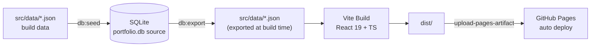

<h1 align="center">JYL Portfolio Site</h1>

<p align="center">Personal job-hunting portfolio single-page app: AI application full-stack engineer covering data engineering, business system delivery, and Windows native desktop engineering.</p>

<p align="center">
  <a href="./README.md">简体中文</a> | <a href="./README.en.md">English</a>
</p>

<p align="center">
  <a href="https://github.com/White-147/jyl-site/actions/workflows/deploy.yml"></a>
  
  
  
  <a href="./LICENSE"></a>
</p>

<p align="center">
  
</p>

A personal job-hunting portfolio single-page app. Positioned as an "AI application full-stack engineer", it showcases verifiable projects such as MiLuStudio, XiaoLouAI, SyLabAI, and LocalLLMServer across three focus areas — data engineering, business system delivery, and Windows native desktop engineering — with project filtering by direction (AI Apps / Enterprise Systems / Big Data), light/dark theme switching, and a one-click download of the latest resume PDF.

Live at [https://white-147.github.io/jyl-site/](https://white-147.github.io/jyl-site/). Content is driven by a SQLite database (`database/portfolio.db`) as the single source of truth; builds export it to JSON automatically, and pushing to `main` triggers GitHub Actions to build and deploy to GitHub Pages.

> Note: site content and the resume stay aligned (real projects and real company names). Raw assets (avatars, certificates, project screenshots) are archived in `_archive/` (committed for backup and later use).

## Features

- Single-page scrolling layout with light/dark theme switching
- Project filtering by direction: AI Apps / Enterprise Systems / Big Data
- Project cards: tech stack, highlights, GitHub links, and screenshots
- **Live project previews**: static frontends embedded under `public/preview/`, opened from the "Try online" action; theme-matched demo banners (dual light/dark) for backend-less projects
- **Demo modes**: BookRecommendation / MiLuStudio ship sample data via build flags (`VUE_APP_EMBEDDED_DEMO` / `VITE_EMBEDDED_DEMO`), landing directly on post-login home pages
- **SPA fallback**: `404.html` routes deep-link refreshes (BrowserRouter subroutes / legacy malformed URLs) back to the owning app entry
- One-click resume PDF download (`public/resume.pdf`, kept in sync with application versions)
- Mobile responsive
- Content-driven: SQLite → export JSON at build time → bundle and deploy

## Tech Stack

| Module | Technology |
| --- | --- |
| Frontend | React 19, TypeScript, Vite, Tailwind CSS 4 |
| Fonts | Five-layer system: Noto Sans SC (body), Smiley Sans (display), Liu Jian Mao Cao (name), Fraunces (numbers), Victor Mono (mono) — self-hosted, subset via `scripts/subset-fonts.mjs` |
| Data | SQLite (`database/portfolio.db`, content source) |
| Scripting | Node.js (seed / export / subset-fonts pipelines; polish-previews demo injection; start-all one-click launcher) |
| Deployment | GitHub Pages + GitHub Actions (`deploy.yml`) |

## Architecture



## Directory Structure

```text
jyl-site/
├── _archive/                 # ★ Raw asset archive (avatars / certs / screenshots / resume originals)
├── database/
│   └── portfolio.db          # ★ SQLite content database (source of truth)
├── docs/
│   └── assets/screenshots/   # Project screenshots
├── public/
│   ├── resume.pdf            # Site resume (overwrite with the latest version)
│   ├── 404.html              # SPA fallback: deep-link refresh → app entry
│   ├── preview/              # ★ Embedded project previews (static bundles + demo injection)
│   ├── projects/*.webp       # Project screenshots (build assets)
│   └── images/ certificates/ # Avatars and certificate thumbnails
├── scripts/
│   ├── seed-db.mjs           #   JSON → database (npm run db:seed)
│   ├── export-db.mjs         #   database → JSON (npm run db:export)
│   ├── subset-fonts.mjs      #   Five-layer font subsetting (rerun after adding copy)
│   ├── polish-previews.mjs   #   Demo-banner injection for preview pages (idempotent)
│   └── start-all.ps1 / .bat  #   One-click local launcher for demo projects
├── src/
│   ├── data/*.json           # Build data (generated by db export; do not hand-edit)
│   ├── data/types.ts         # Type definitions
│   └── components/           # UI components
├── .github/workflows/deploy.yml
├── LICENSE
└── README.md
```

## Live Project Previews

The site embeds project frontends under `public/preview/<id>/` (served directly on GitHub Pages subpaths):

| Project | Online entry | Data source |
| --- | --- | --- |
| SyLabAI / XiaoLouAI / MiLuAssistantWeb | Static frontend + demo banner | None (UI showcase) |
| MiLuStudio | Embedded demo mode (`VITE_EMBEDDED_DEMO`) | Built-in sample projects, lands on the workspace home |
| BookRecommendation | Embedded demo mode (`VUE_APP_EMBEDDED_DEMO`) + demo auto-login | Built-in sample data (books / recommendations / borrows) |
| ShopRecommendation | Separate Render deployment | Full backend |

Under the hood:

- **Demo banners**: `scripts/polish-previews.mjs` injects a "demo mode · backend not deployed" notice into every preview page (brand-matched colors, light/dark dual state) and gracefully replaces backend-absence errors; idempotent — rerun to update.
- **Deep-link fallback**: `public/404.html` detects preview paths and redirects to the owning app entry (no more 404 on refresh).
- **Demo-mode flags**: enabled at build time per project (e.g. `vite build --mode embedded` / `npm run build -- --mode embedded`), normal development is untouched.

## Local Development

```bash
npm install
npm run dev      # dev preview at http://localhost:5173
npm run build    # type check + production build (output dist/)
npm run preview  # preview the production build
```

## Content Workflow

**The content source is `database/portfolio.db` (SQLite)**; builds export it to JSON automatically:

```bash
npm run db:seed    # rebuild the database from src/data/*.json (edit JSON first, then seed)
npm run db:export  # export JSON from the database (npm run build does this automatically)
npm run build      # = db:export + type check + build
```

Two ways to edit content:

1. **Edit JSON → seed**: edit `src/data/*.json` (or the database directly), then run `npm run db:seed`.
2. **Edit database → export**: edit `database/portfolio.db` with a SQLite tool, then run `npm run db:export`.

To update the resume: overwrite `public/resume.pdf` (originals are archived in `_archive/resumes/`).

## Image & Naming Conventions

- Site images live under `public/` grouped by type: `projects/`, `certificates/`, `images/` (avatars)
- **Naming**: lowercase kebab-case; product names stay compact (`milustudio`, `xiaolouai`), generic words use hyphens (`milu-assistant-web`, `book-recommendation`, `cet-4`, `sanchuang-medal`)
- `_archive/` files mirror `public/` files one-to-one with the same names (except the resume PDF, which keeps its original name for recognition)
- The SQLite database stores image paths that must exactly match the real filenames under `public/`; run `npm run db:seed` after adding/renaming images

## Deploy to GitHub Pages

GitHub Actions (`.github/workflows/deploy.yml`) is configured to build and deploy automatically on every push to `main`:

1. Build: `npm ci` → `npm run build` (auto-runs `db:export` from the database, then type check and bundle)
2. Deploy: `upload-pages-artifact` uploads `dist/`, `deploy-pages` publishes to GitHub Pages
3. URL: https://white-147.github.io/jyl-site/

> For a custom domain: bind a registered domain under Settings → Pages. To switch to Vercel/Netlify, adjust the config files and the Actions workflow accordingly.

## Highlights

- Content-driven architecture: single SQLite source of truth, JSON generated at build time — edit data without touching code.
- Aligned with the resume: the site resume download stays in sync with application versions (company names, project names, and timelines consistent).
- Scripted data flow: `db:seed` / `db:export` two-way sync keeps maintenance cheap.
- Automated deployment: push-to-publish via GitHub Actions + GitHub Pages.

## Roadmap

- Bind a custom domain (more stable access in mainland China).
- Add SEO and analytics (sitemap, search engine indexing).
- Add an English version of the site content.
- Add more live screenshots and demo videos for projects.
