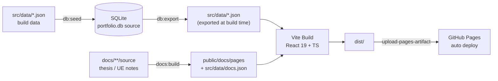

<h1 align="center">JYL Portfolio Site</h1>

<p align="center">Personal job-hunting portfolio single-page app: IT comprehensive role covering data engineering, business system delivery, and Windows native desktop engineering.</p>

<p align="center">
  <a href="./README.md">简体中文</a> | <a href="./README.en.md">English</a>
</p>

<p align="center">
  <a href="https://github.com/White-147/jyl-site/actions/workflows/deploy.yml"></a>
  
  
  
  <a href="./LICENSE"></a>
</p>

<p align="center">
  
</p>

A personal job-hunting portfolio single-page app, organised around an "IT comprehensive role" and covering four focus areas: data engineering, business system delivery, Windows native desktop engineering, and game development (Unreal Engine). It showcases verifiable projects such as MiLuStudio, XiaoLouAI and SyLabAI, and ships an in-site UE study-notes section plus the graduation thesis.

The site offers project filtering by direction (AI Apps / Enterprise Systems / Big Data), fuzzy skill search, light/dark theme switching, one-click project previews, and a resume PDF download. Mobile is adapted separately (bottom tab bar plus a persistent glass top bar), since roughly 60% of traffic comes from phones.

Live at [https://white-147.github.io/jyl-site/](https://white-147.github.io/jyl-site/). Content is driven by a SQLite database (`database/portfolio.db`) as the single source of truth; builds export it to JSON automatically, and pushing to `main` triggers GitHub Actions to build and deploy to GitHub Pages.

> Note: site content and the resume stay aligned (real projects and real company names). Only compressed WebP files live in `public/`; raw originals are no longer kept in the repo or on this machine (the old archive was cleaned up in 2026-09) and should be restored from an external backup, then compressed again.

## Features

- Single-page scrolling layout with three theme modes (light / dark / follow system), status-bar colour synced
- **Project filtering by direction**: AI Apps / Enterprise Systems / Big Data; each project row carries a thumbnail, direction tag, GitHub link and screenshot lightbox
- **Skill profiles**: eight role-direction groups, fuzzy search (case / punctuation / whitespace normalised), quick high-frequency tags
- **About**: staged narrative (early / recent / daily) plus four capability-chain metric cards (data engineering, delivery, AI toolchain, UE game dev)
- **Section navigation**: a persistent glass top bar (brand plus notes / theme / resume / back-to-top), a full-height glass rail on desktop and tablet (section nodes with a reading-progress liquid column), and a floating pill tab bar on mobile
- **Live project previews**: each project's static frontend embedded under `public/preview/`, opened from the "Try online" action; backend-less projects show a demo banner matched to their own palette (light/dark)
- **Docs section**: the thesis and UE notes at `#/docs`, with a section tree, per-page outline, heading anchors, image lightbox, and copy-enabled body text
- **Education and certificates**: school card plus a 2x2 certificate/award grid, click to enlarge the proof image
- **Contact**: click-to-copy email, GitHub link, and a one-click watermarked resume PDF
- Mobile: persistent glass top bar, floating bottom tab bar, safe-area handling, single-column layout
- **Touch interaction**: on phones and tablets the highlight follows the **scroll position** (the card you are looking at lights up, one at a time) with a separate press feedback on tap; desktop keeps its mouse hover unchanged
- Content-driven: SQLite -> JSON at build time -> bundle and deploy, so content edits never touch components
- **Content protection**: obfuscated contact rendering with decoy addresses, iframe guards on preview pages, `robots.txt` rejecting AI-corpus crawlers, full-page diagonal watermark on the resume PDF (text layer preserved, ATS-friendly)
- **Read-only content**: selection and copying are disabled site-wide; only the contact emails and the docs body text are whitelisted via `data-copyable`
- **Accessibility**: WCAG 2.2 AA contrast in both themes (verified with a headless browser), lightbox focus trap and focus restore, full keyboard access, `prefers-reduced-motion` respected, print intercepted and redirected to the PDF resume
- **Performance**: only the name font is inlined for the first screen, CJK fonts limited to three weights (400/500/700) and preloaded on demand, below-the-fold sections render lazily, infinite animations pause off-screen, desktop CLS 0

## Tech Stack

| Module | Technology |
| --- | --- |
| Frontend | React 19, TypeScript, Vite, Tailwind CSS 4 |
| Motion | GSAP (hero entrance sequence) + IntersectionObserver (scroll reveal); `prefers-reduced-motion` respected site-wide |
| Fonts | Five-layer system: Noto Sans SC (body), Smiley Sans (display), Liu Jian Mao Cao (name), Fraunces (numbers), Victor Mono (mono) - all self-hosted, subset via `scripts/subset-fonts.mjs` and first-screen inlined via `inline-firstscreen-fonts.mjs` |
| Icon | The 蒋 mark rendered from the Liu Jian Mao Cao typeface by `scripts/gen_icons.py`, exported as a full favicon set plus maskable |
| Data | SQLite (`database/portfolio.db`, content source) |
| Scripting | Node.js (data seed/export, font and icon pipelines, contact encoding, docs build and assertions) + Python (resume watermarking, image compression, icon generation) |
| Deployment | GitHub Pages + GitHub Actions (`deploy.yml`) |

## Architecture



Content and presentation are fully separated: projects, skills, experience and copy all come from `src/data/*.json`, and components only render them. Docs pages are built from the raw sources under `docs/**/source` by `scripts/build-docs.mjs`. Both pipelines run at build time, so there is no backend at runtime.

## Directory Structure

```text
jyl-site/
├── database/
│   └── portfolio.db          # SQLite content database (source of truth)
├── docs/
│   ├── thesis/source/        # Thesis source (pandoc HTML converted from .docx)
│   ├── theory/source/        # UE theory source (markdown notes)
│   ├── combat/source/        # UE practice source (not imported yet)
│   ├── 联动维护点.md          # Coupled-edit checklist (read before changing code)
│   └── assets/screenshots/   # Site screenshot used by this README
├── public/
│   ├── resume.pdf            # Site resume (overwrite with the latest version)
│   ├── 404.html              # SPA fallback: deep-link refresh -> app entry
│   ├── robots.txt            # Crawl policy (allow search engines, reject AI-corpus crawlers)
│   ├── sitemap.xml           # Site structure
│   ├── manifest.webmanifest  # Icon manifest (includes Android maskable)
│   ├── preview/              # Embedded project previews (static bundles)
│   ├── docs/pages/           # Generated docs pages (gitignored)
│   ├── favicons/             # Site icons (generated by scripts/gen_icons.py)
│   ├── assets/               # Traditional ornament assets (vine mark, seal)
│   ├── projects/             # Project screenshots
│   └── images/ certificates/ # Avatar and certificate thumbnails
├── scripts/
│   ├── seed-db.mjs           # JSON -> database (npm run db:seed)
│   ├── export-db.mjs         # database -> JSON (npm run db:export)
│   ├── subset-fonts.mjs      # Font subsetting (rerun after copy changes)
│   ├── inline-firstscreen-fonts.mjs   # Inline first-screen fonts (runs automatically)
│   ├── gen_icons.py          # Site icons rendered from the Liu Jian Mao Cao typeface
│   ├── build-docs.mjs        # Docs build: split sources into pages, emit nav and manifest
│   ├── check-docs.mjs        # Docs output self-check (missing images, dangling outline, conflicts)
│   ├── check-anchors.mjs     # Real-browser assertions (anchor landing, subbar material, nav smoke)
│   ├── prepare-thesis.mjs    # Thesis .docx -> HTML
│   ├── optimize_images.py    # Compress images to WebP (thesis and UE notes)
│   ├── encode-contact.mjs    # Contact obfuscation table generator
│   ├── watermark_resume.py   # Full-page diagonal watermark for the resume PDF
│   ├── polish-previews.mjs   # Inject demo banners and iframe guards into previews
│   └── start-all.ps1 / .bat  # One-click local launcher for this site and its projects
├── src/
│   ├── data/*.json           # Build data (exported from the database)
│   ├── data/navigation.ts    # Section registry (navigation and scroll spy share it)
│   ├── data/scrollTargets.ts # Single source of truth for anchor offsets
│   ├── data/contact.ts       # Contact obfuscation layer
│   ├── fonts/                # Font subsets (generated by subset-fonts.mjs)
│   ├── hooks/                # useTheme / useScrollSpy / useAnchorScroll etc.
│   └── components/           # Page components
├── .github/workflows/deploy.yml
├── DESIGN.md                 # Design system (tokens and component rules)
├── PRODUCT.md                # Product brief (users, anti-references, principles)
└── LICENSE
```

## Local Development

```bash
npm install
npm run dev      # dev server at http://localhost:5173
npm run build    # type check + production build (outputs dist/)
npm run preview  # preview the production build
```

> Both `dev` and `build` rebuild the docs section first (`predev` / `prebuild`), so the converters never need to be run by hand.

## Content Maintenance (Data Flow)

The source of truth is `database/portfolio.db` (SQLite); builds export it to JSON automatically:

```bash
npm run db:seed    # rebuild/overwrite the database from src/data/*.json
npm run db:export  # export JSON from the database (run automatically by npm run build)
npm run build      # = db:export + type check + build
```

Two ways to edit content: change `src/data/*.json` then `npm run db:seed`, or edit the database with any SQLite tool then `npm run db:export`.

Common maintenance commands:

```bash
npm run fonts:subset                            # rerun after copy changes (new glyphs must enter the subset)
npm run resume:watermark -- --in <original.pdf>  # rerun after replacing the resume
npm run contact:encode                          # rerun after changing email / GitHub
npm run icons:gen                               # regenerate the favicon set
npm run previews:polish                         # rerun after preview pages are updated
npm run docs:verify                             # docs self-check + real-browser assertions
```

## Docs Section (Thesis, UE Theory, UE Practice)

The docs section lives at `#/docs` (hash routing, no server rewrite needed). It turns two kinds of external sources into a readable document site: section tree plus per-page outline, heading anchors, click-to-zoom images (reusing the site lightbox), and copy-enabled body text. Three sections: thesis, UE theory, UE practice.

A source is not necessarily one page: the builder splits each source into multiple pages by heading level (budgeted at four phone screens per page), so a long article no longer takes dozens of swipes to reach the end.

```bash
# Update UE notes
python scripts/optimize_images.py <image dir> public/docs/ue5/images --only-from-md docs/theory/source/<name>.md
npm run fonts:subset                # new CJK glyphs must enter the font subset
npm run build                       # prebuild runs docs:build automatically
npm run docs:check                  # self-check (missing images, dangling outline, dead links, budget)
node scripts/check-anchors.mjs      # real-browser anchor assertions (phone / tablet / desktop)
```

> Page HTML and the manifest are build artefacts and are not committed; `predev` / `prebuild` regenerate them.

## Anti-Scraping and Content Protection

Client-side measures cannot truly block scraping. The goal here is to raise the cost of indiscriminate collection without hurting a recruiter's normal use of the site:

| Layer | Measure | Location |
| --- | --- | --- |
| L1 | `robots.txt` allows search engines but rejects AI-corpus crawlers and bulk-scraping UAs; `sitemap.xml` publishes the structure; outbound links use `rel="noopener noreferrer nofollow"` | `public/robots.txt`, `public/sitemap.xml` |
| L2 | Emails and the GitHub address are stored as character-code tables and decoded at render time; invisible decoy addresses are embedded for crawlers | `src/data/contact.ts`, `scripts/encode-contact.mjs` |
| L3 | The resume PDF is watermarked diagonally across every page without breaking its text layer (still ATS-parseable); originals without a text layer never enter the repo | `scripts/watermark_resume.py` |
| L4 | iframe guards on preview pages (CSP plus frame-busting fallback) | `scripts/polish-previews.mjs` |

On top of that, content is read-only at the frontend level: selection and copying are disabled site-wide, with only the contact emails and the docs body text whitelisted, and the emails come with a click-to-copy button. Printing is intercepted (the site provides no print layout) and redirects to the PDF resume instead.

## Live Project Previews

Each project's static frontend is embedded in the site (`public/preview/<id>/`, served directly from the GitHub Pages subpath):

| Project | Entry | Data source |
| --- | --- | --- |
| SyLabAI / XiaoLouAI / MiLuAssistantWeb | static frontend + demo banner | no backend (UI demo) |
| MiLuStudio | embedded demo mode (`VITE_EMBEDDED_DEMO`) | built-in sample project, deterministic local flow is interactive |
| BookRecommendation | embedded demo mode (`VUE_APP_EMBEDDED_DEMO`) + demo auto-login | built-in sample data (books / recommendations / borrowing) |
| ShopRecommendation | separate Render deployment (also linked from the site) | full backend |

Supporting tooling: `scripts/polish-previews.mjs` injects a demo banner matched to each project's own palette (light and dark) and gracefully replaces backend-less errors; `scripts/sync-preview.mjs <source dist> public/preview/<name>` copies a local production build into the site (adding the icon declarations and verifying that asset references are relative).

## Image and Naming Conventions

- Site images live under `public/`, grouped by type: `projects/`, `certificates/`, `images/` (avatar), `favicons/`, `assets/` (ornaments)
- Naming: lowercase kebab-case; product names stay compact (`milustudio`, `xiaolouai`), generic words use hyphens (`milu-assistant-web`, `book-recommendation`, `cet-4`)
- `public/` holds compressed WebP only (`python scripts/optimize_images.py <src dir> <dest dir>`); originals are never committed
- Site icons are generated artefacts (`scripts/gen_icons.py` plus the Liu Jian Mao Cao typeface); changing the glyph or palette only needs `npm run icons:gen`
- The SQLite content store references exactly the same file names as `public/`; run `npm run db:seed` after adding or renaming images

## Deploying to GitHub Pages

GitHub Actions is already configured (`.github/workflows/deploy.yml`), so pushing to `main` builds and deploys automatically:

1. Build: `npm ci` -> `npm run build` (exports JSON from the database, rebuilds the docs section, type-checks and bundles)
2. Deploy: `upload-pages-artifact` uploads `dist/`, `deploy-pages` publishes to GitHub Pages
3. URL: https://white-147.github.io/jyl-site/

> To use a custom domain, bind it under Settings -> Pages.
>
> A note on speed: all assets are same-origin, so `github.io` is noticeably slow from mainland China without a proxy (the first screen is fine once cached). The code-side size work is done; the remaining bottleneck is the network path, so no mirror or proxy deployment is planned.

## Related Documents

- [DESIGN.md](./DESIGN.md) - design system: colour, typography, elevation, components, prohibitions
- [PRODUCT.md](./PRODUCT.md) - product brief: target users, anti-references, design principles, accessibility
- [docs/联动维护点.md](./docs/联动维护点.md) - coupled-edit checklist (read before changing code)
