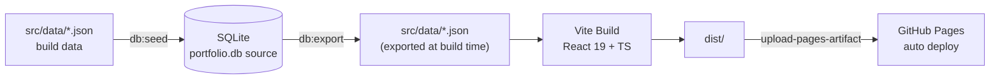

<h1 align="center">JYL Portfolio Site</h1>

<p align="center">Personal job-hunting portfolio single-page app: IT comprehensive role covering data engineering, business system delivery, and Windows native desktop engineering.</p>

<p align="center">
  <a href="./README.md">简体中文</a> | <a href="./README.en.md">English</a>
</p>

<p align="center">
  <a href="https://github.com/White-147/jyl-site/actions/workflows/deploy.yml"></a>
  
  
  
  <a href="./LICENSE"></a>
</p>

<p align="center">
  
</p>

A personal job-hunting portfolio single-page app. Positioned as an "IT comprehensive role", it showcases verifiable projects such as MiLuStudio, XiaoLouAI and SyLabAI plus an in-site UE study-notes section, across four focus areas — data engineering, business system delivery, Windows native desktop engineering, and game development (Unreal Engine) — with project filtering by direction (AI Apps / Enterprise Systems / Big Data), fuzzy skill search, light/dark theme switching, and a one-click download of the latest resume PDF.

Live at [https://white-147.github.io/jyl-site/](https://white-147.github.io/jyl-site/). Content is driven by a SQLite database (`database/portfolio.db`) as the single source of truth; builds export it to JSON automatically, and pushing to `main` triggers GitHub Actions to build and deploy to GitHub Pages.

> Note: site content and the resume stay aligned (real projects and real company names). Raw assets (avatars, certificates, project screenshots) are archived in `_archive/` (committed for backup and later use).

## Features

- Single-page scrolling layout with light/dark theme switching
- Project filtering by direction: AI Apps / Enterprise Systems / Big Data
- Project cards: tech stack, highlights, GitHub links, and screenshots
- **Dual section navigation**: a full-height glass rail on desktop (nodes distributed by each section's scroll progress, liquid column showing reading progress) plus a bottom tab bar and sticky pill nav on mobile
- **Live project previews**: static frontends embedded under `public/preview/`, opened from the "Try online" action; theme-matched demo banners (dual light/dark) for backend-less projects
- **Demo modes**: BookRecommendation / MiLuStudio ship sample data via build flags (`VUE_APP_EMBEDDED_DEMO` / `VITE_EMBEDDED_DEMO`), landing directly on post-login home pages
- **SPA fallback**: `404.html` routes deep-link refreshes (BrowserRouter subroutes / legacy malformed URLs) back to the owning app entry
- One-click resume PDF download (`public/resume.pdf`, kept in sync with application versions)
- Mobile responsive
- Content-driven: SQLite → export JSON at build time → bundle and deploy
- **Anti-scraping and content protection**: obfuscated contact rendering with decoy addresses, iframe guards on preview pages, `robots.txt` rejecting AI-corpus crawlers, full-page diagonal watermark on the resume PDF (text layer preserved, ATS-friendly)
- **Read-only content**: selection and copying are disabled site-wide; only the contact emails are whitelisted via `data-copyable`, paired with a click-to-copy button
- **Accessibility**: WCAG 2.2 AA contrast across both themes (verified), lightbox focus trap and focus restore, print interception redirecting to the PDF resume
- **Performance budget**: `backdrop-filter` capped at 20 elements — all fixed/overlay elements plus section main containers, asserted by `docs:anchors`, infinite animations paused off-screen, particle count scaled to viewport, background layers merged from four to three; no first-paint content shift (CLS 0 on desktop)

## Tech Stack

| Module | Technology |
| --- | --- |
| Frontend | React 19, TypeScript, Vite, Tailwind CSS 4 |
| Motion | GSAP (ScrollTrigger) + IntersectionObserver; `prefers-reduced-motion` respected site-wide |
| Fonts | Five-layer system: Noto Sans SC (body), Smiley Sans (display), Liu Jian Mao Cao (name), Fraunces (numbers), Victor Mono (mono) — self-hosted, subset via `scripts/subset-fonts.mjs` and first-screen inlined via `inline-firstscreen-fonts.mjs` |
| Icon | Rendered from the Liu Jian Mao Cao typeface by `scripts/gen_icons.py`: graphite tile with an amber 蒋 mark, exported as full favicon set + maskable + navbar icon |
| Data | SQLite (`database/portfolio.db`, content source) |
| Scripting | Node.js (seed / export / font and icon pipelines / contact encoding / preview injection) + Python (resume watermarking, icon generation) |
| Deployment | GitHub Pages + GitHub Actions (`deploy.yml`) |

## Architecture



## Directory Structure

```text
jyl-site/
├── _archive/                 # ★ Raw asset archive (avatars / certs / screenshots / resume originals)
├── database/
│   └── portfolio.db          # ★ SQLite content database (source of truth)
├── docs/\r?\n│   ├── thesis/source/        # ★ Thesis source (pandoc HTML from .docx, produced by prepare-thesis.mjs)\r?\n│   ├── theory/source/        # ★ UE theory source (unreal5-notes / ue5-window-* / blueprint-*.md)\r?\n│   ├── combat/source/        # ★ UE practice source (title line only; imported later)\r?\n│   ├── 联动维护点.md          # ★ Coupled-edit checklist (read before changing anything)\r?\n│   └── assets/screenshots/   # Site screenshot used by the README\r?\n├── public/
│   ├── resume.pdf            # Site resume (overwrite with the latest version)
│   ├── 404.html              # SPA fallback: deep-link refresh → app entry
│   ├── robots.txt            # Crawl policy (allow search engines, reject AI-corpus crawlers)
│   ├── sitemap.xml           # Site structure
│   ├── manifest.webmanifest  # Icon manifest (includes Android maskable)
│   ├── preview/              # ★ Embedded project previews (static bundles + demo injection)
│   ├── docs/pages/           # Generated docs pages (build-docs.mjs; gitignored)\r?\n│   ├── favicons/             # Site icons (generated by scripts/gen_icons.py)
│   ├── projects/*.webp       # Project screenshots (build assets)
│   └── images/ certificates/ # Avatar, navbar icon and certificate thumbnails
├── scripts/
│   ├── seed-db.mjs           #   JSON → database (npm run db:seed)
│   ├── export-db.mjs         #   database → JSON (npm run db:export)
│   ├── subset-fonts.mjs      #   Five-layer font subsetting (rerun after adding copy)
│   ├── inline-firstscreen-fonts.mjs  # Inline first-screen fonts into index.html (runs with the step above)
│   ├── gen_icons.py          #   Site icons: render the 蒋 mark from the typeface (npm run icons:gen)
│   ├── build-docs.mjs         #   Docs build: split sources into pages, emit nav + manifest\r?\n│   ├── check-docs.mjs         #   Artifact self-check: source↔output, dangling outline, missing images\r?\n│   ├── check-anchors.mjs      #   Real-browser assertions: cross-doc links, rail collapse, anchors, blur budget\r?\n│   ├── prepare-thesis.mjs     #   Thesis .docx → HTML (extract images, code tables → pre, drop cover)\r?\n│   ├── optimize_images.py     #   Compress figures to webp (shared by thesis and UE notes)\r?\n│   ├── encode-contact.mjs    #   Contact obfuscation table (rerun after editing email/GitHub)
│   ├── watermark_resume.py   #   Full-page diagonal watermark on the resume PDF (keeps text layer)
│   ├── polish-previews.mjs   #   Demo-banner + iframe guard injection (idempotent)
│   └── start-all.ps1 / .bat  #   One-click local launcher for demo projects
├── src/
│   ├── data/*.json           # Build data (generated by db export; do not hand-edit)
│   ├── data/navigation.ts    # Section registry (single source for nav, scroll spy, rail)
│   ├── data/scrollTargets.ts # Anchor offset single source (shared with the scroll-spy line)
│   ├── data/contact.ts       # Contact obfuscation layer
│   ├── data/types.ts         # Type definitions
│   ├── fonts/                # Self-hosted font subsets (generated by subset-fonts.mjs)
│   ├── hooks/                # useTheme / useScrollSpy / useAnchorScroll / useInViewPause …
│   └── components/           # UI components
├── .github/workflows/deploy.yml
├── DESIGN.md                 # Design system (color / type / elevation / components / bans)
├── PRODUCT.md                # Product and strategy (users / anti-references / principles)
├── LICENSE
└── README.md
```

## Live Project Previews

The site embeds project frontends under `public/preview/<id>/` (served directly on GitHub Pages subpaths):

| Project | Online entry | Data source |
| --- | --- | --- |
| SyLabAI / XiaoLouAI / MiLuAssistantWeb | Static frontend + demo banner | None (UI showcase) |
| MiLuStudio | Embedded demo mode (`VITE_EMBEDDED_DEMO`) | Built-in sample projects: parse cards + review cards + navigable progress panel (demo data, interactive local deterministic flow) |
| BookRecommendation | Embedded demo mode (`VUE_APP_EMBEDDED_DEMO`) + demo auto-login | Built-in sample data (books / recommendations / borrows) |
| ShopRecommendation | Separate Render deployment | Full backend |

Under the hood:

- **Demo banners**: `scripts/polish-previews.mjs` injects a "demo mode · backend not deployed" notice into every preview page (brand-matched colors, light/dark dual state) and gracefully replaces backend-absence errors; idempotent — rerun to update.
- **Preview icons**: preview pages and `404.html` declare a favicon, and 4 of the previews additionally declare a 180×180 apple-touch-icon (for large mobile history entries), generated by `scripts/gen-preview-icons.ps1` from each project's logo (SyLabAI uses the Shoayuan/Accela emblem). **Exception**: `book-recommendation` uses `favicon.ico` only — its logo is a 366×85 horizontal wordmark, and the generator **stretches** the source into a square box (no aspect-ratio preservation), so the result was distorted. **Note**: the main site's own icons come from `scripts/gen_icons.py` — they are a separate set.
- **Preview build sync**: `node scripts/sync-preview.mjs <source dist> public/preview/<name>` — copies a local source project's production build into the site as a live preview, adds the icon declaration and **verifies every asset reference is relative** (absolute paths 404 the whole page). ⚠️ The source build needs `--mode embedded` **and** `NODE_ENV=production`: with `--mode embedded` alone, `NODE_ENV` becomes `embedded` and webpack skips production mode (still `eval` devtool, unminified — that single step is why `book-recommendation`'s `js/` dropped from 4.67MB to 1.05MB).
- **Deep-link fallback**: `public/404.html` detects preview paths and redirects to the owning app entry (no more 404 on refresh).
- **Demo-mode flags**: enabled at build time per project (e.g. `vite build --mode embedded` / `npm run build -- --mode embedded`), normal development is untouched.
- **Iframe guard**: `polish-previews.mjs` also injects a `frame-ancestors 'self'` CSP and a frame-busting script so preview pages cannot be embedded by third-party sites.

## Maintenance Actions

```bash
npm run contact:encode     # after editing the email / GitHub in profile.json
npm run resume:watermark   # after a resume update: put the new file in _archive/resumes/ first
npm run previews:polish    # after rebuilds of public/preview/
npm run icons:gen          # after changing the icon glyph or palette
npm run fonts:subset       # after any copy change (subset + re-inline first-screen fonts)
```

## Local Development

```bash
npm install
npm run dev      # dev preview at http://localhost:5173
npm run build    # type check + production build (output dist/)
npm run preview  # preview the production build
```

## Content Workflow

**The content source is `database/portfolio.db` (SQLite)**; builds export it to JSON automatically:

```bash
npm run db:seed    # rebuild the database from src/data/*.json (edit JSON first, then seed)
npm run db:export  # export JSON from the database (npm run build does this automatically)
npm run build      # = db:export + type check + build
```

Two ways to edit content:

1. **Edit JSON → seed**: edit `src/data/*.json` (or the database directly), then run `npm run db:seed`.
2. **Edit database → export**: edit `database/portfolio.db` with a SQLite tool, then run `npm run db:export`.

To update the resume: put the new file into `_archive/resumes/`, then run `npm run resume:watermark`
to regenerate `public/resume.pdf` (the script self-checks the text layer and page count).

## Image & Naming Conventions

- Site images live under `public/` grouped by type: `projects/`, `certificates/`, `images/` (avatar and navbar icon), `favicons/` (site icons)
- **Naming**: lowercase kebab-case; product names stay compact (`milustudio`, `xiaolouai`), generic words use hyphens (`milu-assistant-web`, `book-recommendation`, `cet-4`, `sanchuang-medal`)
- `_archive/` files mirror `public/` files one-to-one with the same names (except the resume PDF, which keeps its original name for recognition)
- Site icons are **generated**, not archived: the source is `scripts/gen_icons.py` plus the Liu Jian Mao Cao typeface — rerun `npm run icons:gen` to change the palette or glyph
- The SQLite database stores image paths that must exactly match the real filenames under `public/`; run `npm run db:seed` after adding/renaming images

## Deploy to GitHub Pages

GitHub Actions (`.github/workflows/deploy.yml`) is configured to build and deploy automatically on every push to `main`:

1. Build: `npm ci` → `npm run build` (auto-runs `db:export` from the database, then type check and bundle)
2. Deploy: `upload-pages-artifact` uploads `dist/`, `deploy-pages` publishes to GitHub Pages
3. URL: https://white-147.github.io/jyl-site/

> For a custom domain: bind a registered domain under Settings → Pages. To switch to Vercel/Netlify, adjust the config files and the Actions workflow accordingly.

## Design System

The design language is captured in these files; treat them as the source of truth:

- **`PRODUCT.md`** — register (brand), target users, anti-references, five design principles, accessibility requirements
- **`DESIGN.md`** — full tokens (color / type / radii / spacing / components) plus the six required sections (Overview / Colors / Typography / Elevation / Components / Do's and Don'ts)
- **`docs/联动维护点.md`** — every "same fact written in two places" coupling, with symptoms and verification steps

- **Visual tone, "graphite + amber"**: the base is pure neutral graphite (a black / white / grey scale); the only accent is warm amber. Light and dark share one family, with the lightness ramp reversed (light goes 50→700 darker, dark goes the other way). Neutrals carry no hue.
- **Color strategy**: amber appears only for "interactive / current / key figures", under 10% of any screen.
- **Contrast**: body text ≥ 4.5:1, decorative boundaries ≥ 3:1. `brand-500` / `brand-600` are never used for text; small type always uses `brand-700`. Both themes are verified with a headless-browser probe.
- **Fonts**: five roles — Noto Sans SC (body, four self-hosted subsets), Smiley Sans (display), Liu Jian Mao Cao (the name), Fraunces (numerals), Victor Mono (mono, with an italic variant). `npm run fonts:subset` subsets and re-inlines the first-screen faces.
- **Icon**: the same Liu Jian Mao Cao typeface renders a graphite tile with an amber 蒋 mark, so the favicon and the hero name share one source.
- **Four card tiers** (redefined 2026-09; the earlier "three tiers" is obsolete):
  1. **Glass panel** `.glass-panel` — the **main container of each section**. Translucent tint + white hairline + `backdrop-filter: url(#lg-refract-soft)` **refraction**. Every value comes from variables, so **themes swap variables, not rules**.
  2. **Tonal card** `.glass-card` / `.glass-card-strong` — small cards inside a section. Same variables, **no refraction**.
  3. **Hairline row** — for lists that should not be boxed.
  4. **Frosted** — fixed and overlay elements only (top bar refraction layer, mobile tab bar, side rail tube, lightbox, theme dropdown).
- **Liquid Glass refraction** (2026-09): the whole top bar plus section main containers bend their backdrop with `feTurbulence` + `feDisplacementMap`. ⚠️ Only Chromium supports `backdrop-filter: url()`; Safari / Firefox fall back to a light blur via `@supports not`. ⚠️ **Never load a displacement map with `feImage`** — measured: it never arrives inside `backdrop-filter`, so the displacement degrades to identity.
- **Hover = full-surface glow** (The Lit-Glass Rule): `.glass-lit` lights up the whole pane on hover / focus-visible / current (cool sheen above, warm amber below). **Not a border recolour**, and no lift. Do not write `hover:border-*` in components.
- **One definition, themes swap variables** (The One-Theme Rule): never hand-pair `dark:bg-slate-*` / `dark:border-slate-*` — that is exactly what produced the "flat coloured box" look, and `dark:bg-slate-800` overrides a glass panel's tint entirely.
- **First paint** (The Boot-Screen Rule): the window before React mounts is owned solely by `#boot` in `index.html` (a vertical light streak + real progress readout). **Only `app:ready` releases it**; timeouts only change the hint text. The static hero skeleton has been removed.
- **First-screen pre-reveal** (The First-Screen Pre-Reveal Rule): `Reveal` shows anything within two viewport heights immediately, with transitions skipped, so nothing below the fold stays blank.
- **Dark elevation**: depth comes from surface tiers (`#121415` → `#1b1e20` → `#23282b`), never from shadows.
- **Motion**: GSAP (hero entrance, about-section connector scrub) plus IntersectionObserver reveals; 150–320ms, exponential ease-out, no bounce; infinite animations (particles, glows) pause off-screen; `prefers-reduced-motion` respected throughout.
- **Signature layout**: editorial hero (oversized name plus avatar signature and a monospace easter egg); asymmetric section headings (title left, `01 / 06` index and a hairline rule right); the project section as an editorial index (row numbers, alternating screenshots, hairline rules instead of boxes); a fuzzy-searched two-column skill grid where the last odd card spans both columns.

## Roadmap

- Bind a custom domain (more stable access in mainland China).
- Add SEO and analytics (sitemap, search engine indexing).
- Add an English version of the site content.
- Add more live screenshots and demo videos for projects.
