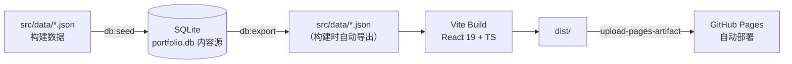

<h1 align="center">蒋宇龙 · 个人作品集网站</h1>

<p align="center">个人求职作品集单页应用：AI 应用平台型全栈工程师，覆盖数据工程、业务系统交付与 Windows 原生桌面端工程化。</p>

<p align="center">
  <a href="./README.md">简体中文</a> | <a href="./README.en.md">English</a>
</p>

<p align="center">
  <a href="https://github.com/White-147/jyl-site/actions/workflows/deploy.yml"></a>
  
  
  
  <a href="./LICENSE"></a>
</p>

<p align="center">
  
</p>

个人求职作品集单页应用。项目以「AI 应用平台型全栈工程师」为定位，围绕数据工程、业务系统交付与 Windows 原生桌面端工程化三条主线，集中展示 MiLuStudio、XiaoLouAI、SyLabAI、LocalLLMServer 等可验证项目，并提供项目方向筛选（AI 应用 / 企业系统 / 大数据）、明暗主题切换与最新简历 PDF 下载。

当前站点已部署上线：[https://white-147.github.io/jyl-site/](https://white-147.github.io/jyl-site/)。内容以 SQLite 数据库（`database/portfolio.db`）为唯一内容源，构建时自动导出为 JSON 并打包，推送到 `main` 分支即通过 GitHub Actions 自动构建部署到 GitHub Pages。

> 说明：站点内容与简历保持同一口径（真实项目与真实公司名）。头像、证书、项目截图原图保存在 `_archive/`（已随仓库上传，供备份与后续补充使用）。

## 项目功能

- 单页滚动式布局，浅色 / 深色模式切换
- 项目按岗位方向筛选：AI 应用 / 企业系统 / 大数据
- 项目卡片：技术栈、要点、GitHub 链接与截图
- 简历 PDF 一键下载（`public/resume.pdf`，随投递版本更新）
- 移动端适配
- 内容驱动：SQLite 数据库 → 构建时导出 JSON → 打包部署

## 技术栈

| 模块 | 技术 |
| --- | --- |
| 前端 | React 19、TypeScript、Vite、Tailwind CSS 4 |
| 数据 | SQLite（`database/portfolio.db`，内容源） |
| 脚本 | Node.js（seed / export 数据同步脚本） |
| 部署 | GitHub Pages + GitHub Actions（`deploy.yml`） |

## 系统架构



## 目录结构

```text
jyl-site/
├── _archive/                 # ★ 原始素材归档（头像 / 证书 / 项目截图 / 简历原件）
├── database/
│   └── portfolio.db          # ★ SQLite 内容库（内容源）
├── docs/
│   └── assets/screenshots/   # 项目截图
├── public/
│   ├── resume.pdf            # 站点简历（最新版覆盖即可）
│   ├── projects/*.webp       # 项目截图（构建资源）
│   └── images/ certificates/ # 头像、证书缩略图
├── scripts/
│   ├── seed-db.mjs           #   JSON → 数据库（npm run db:seed）
│   └── export-db.mjs         #   数据库 → JSON（npm run db:export）
├── src/
│   ├── data/*.json           # 构建数据（由数据库导出生成，勿手改）
│   ├── data/types.ts         # 数据类型定义
│   └── components/           # 页面组件
├── .github/workflows/deploy.yml
├── LICENSE
└── README.md
```

## 本地运行

```bash
npm install
npm run dev      # 开发预览 http://localhost:5173
npm run build    # 类型检查 + 生产构建（输出 dist/）
npm run preview  # 预览生产构建
```

## 内容维护（数据流）

**内容源头是 `database/portfolio.db`（SQLite）**，构建时自动从数据库导出 JSON：

```bash
npm run db:seed    # 用 src/data/*.json 重建/覆盖数据库（改内容时先改 JSON 再 seed）
npm run db:export  # 从数据库导出 JSON（npm run build 会自动执行）
npm run build      # = db:export + 类型检查 + 构建
```

日常改内容的两种方式：

1. **改 JSON → 入库**：编辑 `src/data/*.json`（或直接改数据库），执行 `npm run db:seed` 同步到库；
2. **改数据库 → 出 JSON**：直接用 SQLite 工具改 `database/portfolio.db`，执行 `npm run db:export` 重新生成 JSON。

换简历：覆盖 `public/resume.pdf`（原件归档在 `_archive/resumes/`）。
新增证书/头像：压缩后的 WebP 放 `public/` 对应目录，原图放入 `_archive/` 对应目录，再改 `education.json` 或相关数据。

## 图片与命名规范

- 站点图片统一放 `public/` 下，按类型分目录：`projects/`、`certificates/`、`images/`（头像）
- **命名规则**：小写 kebab-case（连字符分隔）；产品名保持紧凑（`milustudio`、`xiaolouai`），通用词用连字符（`milu-assistant-web`、`book-recommendation`、`cet-4`、`sanchuang-medal`）
- `_archive/` 归档文件与 `public/` 站点文件一一对应、命名一致（简历 PDF 除外，保留原名便于识别）
- 数据源为 SQLite（`database/portfolio.db`），其中存储的图片路径与 `public/` 实际文件名严格一致；新增/改名图片后执行 `npm run db:seed` 同步

## 部署到 GitHub Pages

仓库已配置 GitHub Actions（`.github/workflows/deploy.yml`），推送到 `main` 分支即自动构建并部署：

1. 构建流程：`npm ci` → `npm run build`（自动执行 `db:export` 从数据库导出 JSON，再做类型检查与打包）
2. 部署流程：`upload-pages-artifact` 上传 `dist/`，`deploy-pages` 发布到 GitHub Pages
3. 访问地址：https://white-147.github.io/jyl-site/

> 如需自定义域名：在仓库 Settings → Pages 中绑定已备案域名；如切换 Vercel/Netlify 部署，将根目录 `_redirects`/配置文件与 Actions 工作流一并调整即可。

## 项目亮点

- 内容驱动架构：SQLite 单一内容源，JSON 由构建导出，改数据不碰代码。
- 与简历同口径：站点简历下载与投递版保持同步更新，公司名、项目名、时间线一致。
- 数据流脚本化：`db:seed` / `db:export` 双向同步，内容维护成本低。
- 自动化部署：推送即构建发布（GitHub Actions + GitHub Pages），无需手动操作。

## 后续可改进方向

- 绑定自定义域名（国内访问更稳定）。
- 补充 SEO 与访问统计（站点地图、搜索引擎收录）。
- 增加英文版站点内容。
- 补充更多项目实测截图与演示视频。
