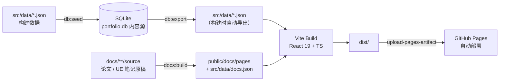

<h1 align="center">蒋宇龙 · 个人作品集网站</h1>

<p align="center">个人求职作品集单页应用：信息技术综合岗位，覆盖数据工程、业务系统交付与 Windows 原生桌面端工程化。</p>

<p align="center">
  <a href="./README.md">简体中文</a> | <a href="./README.en.md">English</a>
</p>

<p align="center">
  <a href="https://github.com/White-147/jyl-site/actions/workflows/deploy.yml"></a>
  
  
  
  <a href="./LICENSE"></a>
</p>

<p align="center">
  
</p>

个人求职作品集单页应用，围绕「信息技术综合岗位」组织内容，覆盖数据工程、业务系统交付、Windows 原生桌面端工程化与游戏开发（虚幻引擎）四条主线，集中展示 MiLuStudio、XiaoLouAI、SyLabAI 等可验证项目，并内置站内 UE 学习笔记与毕业论文。

站点提供项目方向筛选（AI 应用 / 企业系统 / 大数据）、技能模糊搜索、明暗主题切换、项目在线体验入口与简历 PDF 下载；手机端按 60% 流量口径单独适配（底部 Tab Bar + 常驻玻璃顶栏）。

当前站点已部署上线：[https://white-147.github.io/jyl-site/](https://white-147.github.io/jyl-site/)。内容以 SQLite 数据库（`database/portfolio.db`）为唯一内容源，构建时自动导出为 JSON 并打包，推送到 `main` 分支即通过 GitHub Actions 自动构建部署到 GitHub Pages。

> 说明：站点内容与投递简历保持同一口径（真实项目与真实公司名）。头像、证书、项目截图、UE 笔记配图**只保留压缩后的 WebP**（在 `public/` 里），原图归档已于 2026-09 清理、不再随仓库与本机保存 —— 需要原图时从外部备份取回，并按「图片与命名规范」重新压缩。

## 项目功能

- 单页滚动式布局，浅色 / 深色 / 跟随系统三种主题模式，状态栏配色同步
- **项目按岗位方向筛选**：AI 应用 / 企业系统 / 大数据，项目行含缩略图、方向标签、GitHub 入口与截图灯箱
- **技能画像**：8 个岗位方向画像分组展示、模糊搜索（大小写 / 符号 / 空格归一）、高频快捷标签
- **关于我**：早期 / 近期 / 日常阶段化叙事 + 四条能力链路数字卡片（数据工程 / 业务交付 / AI 工具链 / UE 游戏开发）
- **区块导航**：全端常驻玻璃顶栏（品牌 +「笔记 / 主题 / 简历 / 顶部」四个控件）+ 桌面与平板右侧贯穿式玻璃管（章节节点 + 阅读进度液柱）+ 手机端底部浮动胶囊 Tab Bar
- **项目在线体验**：各项目静态前端嵌入本站（`public/preview/`），卡片「在线体验」直达；无后端项目显示适配其配色的演示提示条（深浅色双态）
- **文档区**：站内 `#/docs` 收录毕业论文与 UE 学习笔记，左侧分区目录树 + 本篇大纲 + 标题锚点跳转 + 配图灯箱，正文整块可复制
- **教育经历与证书**：学校信息卡 + 证书/奖项 2×2 网格，点击放大查看证明原件
- **联系区**：邮箱「点击复制」、GitHub 等入口，一键下载带水印的简历 PDF
- 移动端适配：常驻玻璃顶栏、底部浮动胶囊 Tab Bar、安全区、单列布局
- **触屏交互**：手机与平板上的高亮跟随**滚动位置**（视线所在的那张卡亮起，任何时刻只有一张），点击另有按下反馈；桌面端保持鼠标悬停不变
- 内容驱动：SQLite 数据库 → 构建时导出 JSON → 打包部署，改内容不碰组件
- **内容保护**：邮箱混淆渲染 + 诱饵地址、预览页 iframe 防护、`robots.txt` 拒 AI 语料采集、简历 PDF 全页对角水印（保留文本层，ATS 友好）
- **内容只读**：默认禁止选中/复制，仅联系区邮箱与文档区正文标记 `data-copyable` 放行
- **可访问性**：正文对比度满足 WCAG 2.2 AA（浅深两套均以无头浏览器实测复核）、灯箱焦点陷阱与焦点归还、键盘全可达、尊重 `prefers-reduced-motion`、打印拦截并引导至 PDF 简历
- **性能**：首屏只内联名字字体、中文字体保留 400/500/700 三档并按需 preload、首屏以下区块延迟渲染、常驻动画离屏暂停、桌面 CLS 0

## 技术栈

| 模块 | 技术 |
| --- | --- |
| 前端 | React 19、TypeScript、Vite、Tailwind CSS 4 |
| 动效 | GSAP（首屏入场序列）+ IntersectionObserver（滚动渐显），全站尊重 `prefers-reduced-motion` |
| 字体 | 五层字体体系：正文 Noto Sans SC、展示层得意黑（Smiley Sans）、名字柳建毛草、数字 Fraunces、等宽 Victor Mono（`scripts/subset-fonts.mjs` 子集化 + `inline-firstscreen-fonts.mjs` 内联首屏，全部自托管） |
| 图标 | 由柳建毛草字体渲染「蒋」字标（`scripts/gen_icons.py`），输出 favicon 全尺寸 + maskable |
| 数据 | SQLite（`database/portfolio.db`，内容源） |
| 脚本 | Node.js（数据 seed/export、字体与图标管线、联系方式编码、文档构建与断言）+ Python（简历水印、配图压缩、图标生成） |
| 部署 | GitHub Pages + GitHub Actions（`deploy.yml`） |

## 系统架构



内容与展示完全分离：项目、技能、经历、文案全部来自 `src/data/*.json`，组件只负责渲染与交互；文档区正文由 `scripts/build-docs.mjs` 从 `docs/**/source` 的原始稿件构建成静态页，两者都在构建期完成，运行时没有后端。

## 目录结构

```text
jyl-site/
├── database/
│   └── portfolio.db          # ★ SQLite 内容库（内容源）
├── docs/
│   ├── thesis/source/        # ★ 毕业论文源（pandoc 从 docx 转出的 HTML）
│   ├── theory/source/        # ★ UE 理论源（markdown 笔记）
│   ├── combat/source/        # ★ UE 实战源（待导入）
│   ├── 联动维护点.md          #   多处联动的维护清单（改代码前必读）
│   └── assets/screenshots/   #   README 展示用站点截图
├── public/
│   ├── resume.pdf            #   站点简历（最新版覆盖即可）
│   ├── 404.html              #   SPA fallback：深链刷新兜底回应用入口
│   ├── robots.txt            #   抓取策略（放行搜索引擎、拒绝 AI 语料采集）
│   ├── sitemap.xml           #   站点结构
│   ├── manifest.webmanifest  #   站点图标清单（含 Android maskable）
│   ├── preview/              # ★ 内嵌项目预览（各项目前端静态产物）
│   ├── docs/pages/           #   文档区页面产物（构建生成，已 gitignore）
│   ├── favicons/             #   站点图标（由 scripts/gen_icons.py 生成）
│   ├── assets/               #   传统纹样装饰件（卷草纹章、忍冬印章）
│   ├── projects/             #   项目截图
│   └── images/ certificates/ #   头像、证书缩略图
├── scripts/
│   ├── seed-db.mjs           #   JSON → 数据库（npm run db:seed）
│   ├── export-db.mjs         #   数据库 → JSON（npm run db:export）
│   ├── subset-fonts.mjs      #   五层字体子集化（新增文案后重跑）
│   ├── inline-firstscreen-fonts.mjs   # 首屏字体 base64 内联（随上一步自动运行）
│   ├── gen_icons.py          #   站点图标：从柳建毛草渲染「蒋」字标
│   ├── build-docs.mjs        #   文档区构建：把源拆成页并生成导航与清单
│   ├── check-docs.mjs        #   文档产物自检（配图缺失 / 大纲悬空 / 路由冲突）
│   ├── check-anchors.mjs     #   真浏览器断言（锚点落点 / 横栏材质 / 导航冒烟）
│   ├── prepare-thesis.mjs    #   论文 docx → HTML
│   ├── optimize_images.py    #   配图压缩成 WebP（论文与 UE 笔记共用）
│   ├── encode-contact.mjs    #   联系方式混淆表生成
│   ├── watermark_resume.py   #   简历 PDF 全页对角水印
│   ├── polish-previews.mjs   #   预览页演示提示 + iframe 防护注入
│   └── start-all.ps1 / .bat  #   一键启动本站与各项目（本地演示）
├── src/
│   ├── data/*.json           #   构建数据（由数据库导出生成）
│   ├── data/navigation.ts    #   区块注册表（导航 / 滚动侦测共用）
│   ├── data/scrollTargets.ts #   锚点偏移单一来源
│   ├── data/contact.ts       #   联系方式混淆层
│   ├── fonts/                #   字体子集（subset-fonts.mjs 生成）
│   ├── hooks/                #   useTheme / useScrollSpy / useAnchorScroll 等
│   └── components/           #   页面组件
├── .github/workflows/deploy.yml
├── DESIGN.md                 #   设计系统（token 与组件规范）
├── PRODUCT.md                #   产品口径（用户 / 反参考 / 设计原则）
└── LICENSE
```

## 本地运行

```bash
npm install
npm run dev      # 开发预览 http://localhost:5173
npm run build    # 类型检查 + 生产构建（输出 dist/）
npm run preview  # 预览生产构建
```

> `dev` 与 `build` 都会先自动重建文档区产物（`predev` / `prebuild`），所以不需要手动跑转换脚本。

## 内容维护（数据流）

**内容源头是 `database/portfolio.db`（SQLite）**，构建时自动从数据库导出 JSON：

```bash
npm run db:seed    # 用 src/data/*.json 重建/覆盖数据库（改内容时先改 JSON）
npm run db:export  # 从数据库导出 JSON（npm run build 会自动执行）
npm run build      # = db:export + 类型检查 + 构建
```

日常改内容两种方式：编辑 `src/data/*.json` 后 `npm run db:seed` 入库；或直接用 SQLite 工具改库后 `npm run db:export` 出 JSON。

常用维护动作：

```bash
npm run fonts:subset                            # 新增/修改文案后重跑（新用字不进子集会回退系统字体）
npm run resume:watermark -- --in <原件.pdf>      # 换简历后重跑（生成带水印的 public/resume.pdf）
npm run contact:encode                          # 改过邮箱 / GitHub 后重跑
npm run icons:gen                               # 换图标字或配色后重新生成 favicon
npm run previews:polish                         # 预览页更新后重跑（演示提示 + iframe 防护）
npm run docs:verify                             # 文档产物自检 + 真浏览器断言
```

## 文档区（毕业论文 · UE 理论 · UE 实战）

站内文档区位于 `#/docs`（hash 路由，不需要服务端重写），把两类外部原稿转成可读的文档站：左侧分区 + 目录树 + 本篇大纲、标题锚点跳转、配图点击放大（复用站点灯箱）、正文整块放开复制。三个分区：**毕业论文 / UE 理论 / UE 实战**。

源不是「一篇 = 一页」：构建器按标题层级把每篇源自动拆成多页（按手机口径预算 4 屏/页），避免一篇文章在手机上要滚几十屏才到底。

```bash
# UE 笔记更新
python scripts/optimize_images.py <原图目录> public/docs/ue5/images --only-from-md docs/theory/source/<name>.md
npm run fonts:subset                # 新汉字要进字体子集
npm run build                       # prebuild 会自动跑 docs:build
npm run docs:check                  # 产物自检（配图缺失 / 大纲悬空 / 互链死链 / 预算突破）
node scripts/check-anchors.mjs      # 真浏览器断言锚点落点（手机 / 平板 / 桌面三档视口）
```

> 页面 HTML 与清单是**构建产物，不进 git**，由 `predev` / `prebuild` 自动重建。

## 反爬与内容保护

客户端方案无法真正阻止抓取，这里的目标是提高无差别采集的成本，同时不影响招聘方的正常使用：

| 层 | 手段 | 位置 |
| --- | --- | --- |
| L1 | `robots.txt` 放行搜索引擎、拒绝 AI 语料采集与批量抓取 UA；`sitemap.xml` 提供结构；外链统一 `rel="noopener noreferrer nofollow"` | `public/robots.txt`、`public/sitemap.xml` |
| L2 | 邮箱与 GitHub 地址以字符码表存储、渲染时才解码；页面内埋入读屏与视觉均不可见的诱饵邮箱 | `src/data/contact.ts`、`scripts/encode-contact.mjs` |
| L3 | 简历 PDF 全页对角平铺水印，不破坏文本层（ATS 仍可解析）；无文本层的简历原件不进仓库 | `scripts/watermark_resume.py` |
| L4 | 预览页 iframe 防护（CSP + frame-busting 兜底） | `scripts/polish-previews.mjs` |

另有前端层的内容只读：全站默认禁止选中/复制，仅联系区邮箱与文档区正文放行，邮箱配套「点击复制」按钮。打印一律拦截（站点不提供打印版式），改为提示引导至 PDF 简历。

## 项目在线体验

站点内嵌各项目前端（`public/preview/<id>/`，GitHub Pages 子路径直接服务）：

| 项目 | 在线入口 | 数据来源 |
| --- | --- | --- |
| SyLabAI / XiaoLouAI / MiLuAssistantWeb | 静态前端 + 演示提示条 | 无后端（界面演示） |
| MiLuStudio | 嵌入演示模式（`VITE_EMBEDDED_DEMO`） | 内置示例项目，本地确定性流程可交互 |
| BookRecommendation | 嵌入演示模式（`VUE_APP_EMBEDDED_DEMO`）+ 演示自动登录 | 内置示例数据（图书 / 推荐 / 借阅） |
| ShopRecommendation | 独立 Render 部署（另有主页链接） | 完整后端 |

配套机制：`scripts/polish-previews.mjs` 向每个预览页注入与项目品牌配色一致的演示提示条（深浅色双态）并把缺后端报错优雅替换；`scripts/sync-preview.mjs <源工程 dist> public/preview/<名字>` 负责把本地源工程的生产构建拷成站内预览（顺带补图标声明并校验资源引用为相对路径）。

## 图片与命名规范

- 站点图片统一放 `public/` 下，按类型分目录：`projects/`（项目截图）、`certificates/`（证书）、`images/`（头像）、`favicons/`（站点图标）、`assets/`（纹样装饰件）
- 命名规则：小写 kebab-case；产品名保持紧凑（`milustudio`、`xiaolouai`），通用词用连字符（`milu-assistant-web`、`book-recommendation`、`cet-4`）
- `public/` 只放压缩后的 WebP（`python scripts/optimize_images.py <原图目录> <目标目录>`），原图一律不入库
- 站点图标是生成物（`scripts/gen_icons.py` + 柳建毛草字体），改配色或换字只需重跑 `npm run icons:gen`
- 数据源为 SQLite，其中存储的图片路径与 `public/` 实际文件名严格一致；新增/改名图片后执行 `npm run db:seed` 同步

## 部署到 GitHub Pages

仓库已配置 GitHub Actions（`.github/workflows/deploy.yml`），推送到 `main` 分支即自动构建并部署：

1. 构建：`npm ci` → `npm run build`（自动 `db:export` 从数据库导出 JSON，再重建文档区、做类型检查与打包）
2. 部署：`upload-pages-artifact` 上传 `dist/`，`deploy-pages` 发布到 GitHub Pages
3. 访问地址：https://white-147.github.io/jyl-site/

> 如需自定义域名：在仓库 Settings → Pages 中绑定域名。
>
> 访问速度说明：站点资源全部同源托管，`github.io` 在大陆无代理时会明显偏慢（首屏走缓存后正常）。代码侧体积优化已完成，剩下的瓶颈是线路本身，当前不做镜像或代理部署。

## 相关文档

- [DESIGN.md](./DESIGN.md)：设计系统，颜色 / 字体 / 层级 / 组件 / 禁忌
- [PRODUCT.md](./PRODUCT.md)：产品口径，目标用户 / 反参考 / 设计原则 / 可访问性要求
- [docs/联动维护点.md](./docs/联动维护点.md)：同一事实写在多处的联动点清单（改代码前必读）
