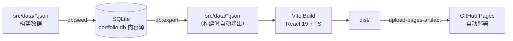

<h1 align="center">蒋宇龙 · 个人作品集网站</h1>

<p align="center">个人求职作品集单页应用：信息技术综合岗位，覆盖数据工程、业务系统交付与 Windows 原生桌面端工程化。</p>

<p align="center">
  <a href="./README.md">简体中文</a> | <a href="./README.en.md">English</a>
</p>

<p align="center">
  <a href="https://github.com/White-147/jyl-site/actions/workflows/deploy.yml"></a>
  
  
  
  <a href="./LICENSE"></a>
</p>

<p align="center">
  
</p>

个人求职作品集单页应用。项目以「信息技术综合岗位」为定位，围绕数据工程、业务系统交付、Windows 原生桌面端工程化与游戏开发（虚幻引擎）四条主线，集中展示 MiLuStudio、XiaoLouAI、SyLabAI 等可验证项目与站内 UE 学习笔记，并提供项目方向筛选（AI 应用 / 企业系统 / 大数据）、技能模糊搜索、明暗主题切换与最新简历 PDF 下载。

当前站点已部署上线：[https://white-147.github.io/jyl-site/](https://white-147.github.io/jyl-site/)。内容以 SQLite 数据库（`database/portfolio.db`）为唯一内容源，构建时自动导出为 JSON 并打包，推送到 `main` 分支即通过 GitHub Actions 自动构建部署到 GitHub Pages。

> 说明：站点内容与简历保持同一口径（真实项目与真实公司名）。头像、证书、项目截图原图保存在 `_archive/`（已随仓库上传，供备份与后续补充使用）。

## 项目功能

- 单页滚动式布局，浅色 / 深色模式切换（跟随系统或手动，状态栏配色同步）
- 项目按岗位方向筛选：AI 应用 / 企业系统 / 大数据
- 项目索引列表：行号 + 缩略图 + 技术栈展开/收起 + 要点折叠 + 灯箱放大
- 技能画像分组展示：8 个岗位方向画像、模糊搜索（大小写/符号/空格归一）、高频快捷标签
- About 阶段化叙事：早期 / 近期 / 日常 + 四条能力链路数字卡片（数据工程 / 业务交付 / AI 工具链 / UE 游戏开发，2×2 双列网格）
- **区块导航**：**全端常驻顶部栏**（整宽玻璃，左侧品牌 / 右侧四个同材质控件「笔记 · 返回顶部 · 主题 · 简历」）
  + 桌面与平板的右侧贯穿式玻璃管（只做章节节点 + 液柱，管外不挂控件）
  + 手机端底部浮动胶囊 Tab Bar（只做章节跳转）
- **项目在线预览**：各项目的静态前端嵌入本站（`public/preview/`），卡片「在线体验」直达；无后端项目显示适配各项目风格的演示提示条（深浅色双态）
- **演示模式**：BookRecommendation / MiLuStudio 采用构建开关（`VUE_APP_EMBEDDED_DEMO` / `VITE_EMBEDDED_DEMO`）内置示例数据，无后端也能直入登录后首页
- **SPA fallback**：`404.html` 将深链刷新（BrowserRouter 子路由 / 遗留畸形 URL）兜底回所属应用入口
- 简历 PDF 一键下载（`public/resume.pdf`，随投递版本更新）
- 移动端适配：常驻顶栏（玻璃材质）、底部浮动胶囊 Tab Bar、安全区、单列布局
- 内容驱动：SQLite 数据库 → 构建时导出 JSON → 打包部署
- **反爬与内容保护**：邮箱混淆渲染 + 诱饵地址、预览页 iframe 防护、`robots.txt` 拒 AI 语料采集、简历 PDF 全页对角水印（保留文本层，ATS 友好）
- **内容只读**：默认禁止选中/复制，仅联系区邮箱标记 `data-copyable` 放行（配合「点击复制」按钮）
- **可访问性达标**：全站对比度满足 WCAG 2.2 AA（浅深两套均实测通过）、灯箱焦点陷阱与焦点归还、打印拦截并引导至 PDF 简历
- **性能预算**：首屏 HTML 只内联 10KB 的名字字体（得意黑 138KB 改按需外链，不再计入每次 HTML 请求）；中文字体只保留 **400/500/700** 三档（900 档无人引用、已删，省 146KB），且只 preload 首屏真正会画的 400/500；`background-attachment: fixed` 已取消（改独立 fixed 合成层）、`<768px` 不挂载右侧导轨（连带其滚动监听与观察器）、滚动侦测的元素引用做缓存、常驻动画离屏暂停、**ScrollTrigger 已从产物移除**（About 连接线改 IntersectionObserver + CSS 过渡）、首屏以下区块 `content-visibility: auto`、CLS 桌面 0。常驻 `backdrop-filter` 只保留两处（顶栏与手机底部 Tab Bar，同一材质），其余浮层按需
  > ⚠️ 写 `backdrop-filter` 时**只写标准属性**，不要手写 `-webkit-` 前缀：两者同时出现会被构建期精简掉一条（实测只剩 `-webkit-`，导致 Chrome 里玻璃完全不生效）。见 `src/index.css` 的 `.site-bar` 注释。

## 技术栈

| 模块 | 技术 |
| --- | --- |
| 前端 | React 19、TypeScript、Vite、Tailwind CSS 4 |
| 动效 | GSAP（ScrollTrigger）+ IntersectionObserver，全站尊重 `prefers-reduced-motion` |
| 字体 | 五层字体体系：正文 Noto Sans SC、展示层得意黑（Smiley Sans）、名字柳建毛草、数字 Fraunces、等宽 Victor Mono（`scripts/subset-fonts.mjs` 子集化 + `inline-firstscreen-fonts.mjs` 内联首屏，均自托管） |
| 图标 | 由柳建毛草字体现场渲染「蒋」字标（`scripts/gen_icons.py`），石墨底 + 琥珀字，输出 favicon 全尺寸 + maskable + 导航图标 |
| 数据 | SQLite（`database/portfolio.db`，内容源） |
| 脚本 | Node.js（seed / export / 字体与图标管线 / 联系方式编码 / 预览注入）+ Python（简历水印、图标生成） |
| 部署 | GitHub Pages + GitHub Actions（`deploy.yml`） |

## 系统架构



站点内容与展示完全分离：内容（项目、技能、经历、文案）全部来自 `src/data/*.json`，组件只负责渲染与交互；内容变更通过 `db:seed` / `db:export` 双向同步，改数据不碰代码。

## 目录结构

```text
jyl-site/
├── _archive/                 # ★ 原始素材归档（头像 / 证书 / 项目截图 / 简历原件）
├── database/
│   └── portfolio.db          # ★ SQLite 内容库（内容源）
├── docs/
│   ├── 联动维护点.md          # ★ 「同一事实写在两处」的联动点清单（改动前必读）
│   └── assets/screenshots/   # README 展示用站点截图
├── public/
│   ├── resume.pdf            # 站点简历（最新版覆盖即可）
│   ├── 404.html              # SPA fallback：深链刷新兜底回应用入口
│   ├── robots.txt            # 抓取策略（放行搜索引擎、拒绝 AI 语料采集）
│   ├── sitemap.xml           # 站点结构
│   ├── manifest.webmanifest  # 站点图标清单（含 Android maskable）
│   ├── preview/              # ★ 内嵌项目预览（各项目前端静态产物 + 演示注入）
│   ├── favicons/             # 站点图标（由 scripts/gen_icons.py 生成）
│   ├── projects/*.webp       # 项目截图（构建资源）
│   └── images/ certificates/ # 头像、导航图标、证书缩略图
├── scripts/
│   ├── seed-db.mjs           #   JSON → 数据库（npm run db:seed）
│   ├── export-db.mjs         #   数据库 → JSON（npm run db:export）
│   ├── subset-fonts.mjs      #   站点五层字体子集化（新增文案后重新运行）
│   ├── inline-firstscreen-fonts.mjs  # 首屏字体 base64 内联进 index.html（随上一步自动运行）
│   ├── gen_icons.py          #   站点图标：从柳建毛草渲染「蒋」字标（npm run icons:gen）
│   ├── encode-contact.mjs    #   联系方式混淆表生成（改邮箱/GitHub 后运行）
│   ├── watermark_resume.py   #   简历 PDF 全页对角水印（保留文本层）
│   ├── polish-previews.mjs   #   预览页演示提示 + iframe 防护注入（重跑即覆盖更新）
│   └── start-all.ps1 / .bat  #   面试演示：一键启动本站各项目（本地运行）
├── src/
│   ├── data/*.json           # 构建数据（由数据库导出生成，勿手改）
│   ├── data/navigation.ts    # 区块注册表（导航 / 滚动侦测 / 导轨共用单一数据源）
│   ├── data/scrollTargets.ts # 锚点偏移单一来源（滚动侦测线同源）
│   ├── data/contact.ts       # 联系方式混淆层
│   ├── data/types.ts         # 数据类型定义
│   ├── fonts/                # 站点专用字体子集（subset-fonts.mjs 生成）
│   ├── hooks/                # useTheme / useScrollSpy / useAnchorScroll / useInViewPause 等
│   └── components/           # 页面组件
├── .github/workflows/deploy.yml
├── DESIGN.md                 # 设计系统（颜色 / 字体 / 层级 / 组件 / 禁忌）
├── PRODUCT.md                # 产品与策略口径（用户 / 反参考 / 设计原则）
├── LICENSE
└── README.md
```

## 项目在线预览

站点内嵌各项目前端（`public/preview/<id>/`，GitHub Pages 子路径直接服务），详情如下：

| 项目 | 在线入口 | 数据来源 |
| --- | --- | --- |
| SyLabAI / XiaoLouAI / MiLuAssistantWeb | 静态前端 + 演示提示条 | 无后端（界面演示） |
| MiLuStudio | 嵌入演示模式（`VITE_EMBEDDED_DEMO`） | 内置示例项目：解析卡 + 步骤审核卡 + 可跳转进度区（演示数据，本地确定性流程可交互） |
| BookRecommendation | 嵌入演示模式（`VUE_APP_EMBEDDED_DEMO`）+ 演示自动登录 | 内置示例数据（图书/推荐/借阅） |
| ShopRecommendation | 独立 Render 部署（另有主页链接） | 完整后端 |

配套机制：

- **演示提示条**：`scripts/polish-previews.mjs` 向每个预览页注入「演示模式 · 后端未部署」提示（**按项目品牌配色、深浅色双态**），并将缺后端报错优雅替换；幂等，重跑即更新
- **预览图标**：预览页与 `404.html` 声明 favicon，其中 4 个预览另声明 180×180 apple-touch-icon（移动端历史页大图标），由 `scripts/gen-preview-icons.ps1` 从各项目 logo 生成（SyLabAI 使用韶远/Accela 徽标截取）。**例外**：`book-recommendation` 只用 `favicon.ico` —— 它的 logo 是 366×85 横排字标，而这个脚本是把源图**拉伸**进方形框（不保持宽高比），生成出来是变形的，故不声明。**注意**：主站自身的 favicon 由 `scripts/gen_icons.py` 单独生成，两者不是同一套
- **预览产物同步**：`node scripts/sync-preview.mjs <源工程 dist> public/preview/<名字>` —— 把本地源工程的生产构建拷成站内预览，顺带补图标声明并**校验资源引用是相对路径**（绝对路径会导致整页 404）。⚠️ 源工程构建必须 `--mode embedded` **且** `NODE_ENV=production`：只给 `--mode embedded` 时 `NODE_ENV` 会变成 `embedded`，webpack 不走 production（实测仍是 `eval` devtool、不压缩，`book-recommendation` 的 `js/` 从 4.67MB 变成 1.05MB 全靠这一步）
- **深链刷新兜底**：`public/404.html` 识别预览路径并跳回应用入口（BrowserRouter 应用刷新不再 404）
- **演示模式开关**：各项目以构建时环境变量启用（不污染正常开发），如 `npx vite build --mode embedded` / `npm run build -- --mode embedded`
- **iframe 防护**：`polish-previews.mjs` 同时向每个预览页注入 `frame-ancestors 'self'` CSP 与 frame-busting 脚本，阻止预览页被外部站点嵌套抓取

## 反爬与内容保护

客户端方案无法真正阻止抓取，这里的目标是**提高无差别采集的成本**，同时不牺牲招聘方的正常使用：

| 层 | 手段 | 位置 |
| --- | --- | --- |
| L1 | `robots.txt` 放行搜索引擎、拒绝 AI 语料采集与批量抓取 UA；`sitemap.xml` 提供结构；外链统一 `rel="noopener noreferrer nofollow"` | `public/robots.txt`、`public/sitemap.xml` |
| L2 | 邮箱与 GitHub 地址以字符码表存储、渲染时才解码；页面内埋入读屏与视觉均不可见的诱饵邮箱 | `src/data/contact.ts`、`scripts/encode-contact.mjs` |
| L3 | 简历 PDF 全页对角平铺水印，**不破坏文本层**（ATS 仍可解析）；原件保留在 `_archive/resumes/` | `scripts/watermark_resume.py` |
| L4 | 预览页 iframe 防护（CSP + frame-busting 兜底） | `scripts/polish-previews.mjs` |

内容只读（前端层）：全站默认禁止选中/复制（`useReadOnlyGuard` + `body { user-select: none }`），
仅联系区两个邮箱标注 `data-copyable` 放行，并配套「点击复制」按钮与成功提示。

维护动作：

```bash
npm run contact:encode     # 改过 profile.json 的邮箱 / GitHub 后运行
npm run resume:watermark   # 换简历后：先把新版放进 _archive/resumes/，再运行
npm run previews:polish    # 预览页重新构建复制进 public/preview/ 后运行
npm run icons:gen          # 换图标字或配色后重新生成 favicon 全尺寸
```

> 打印一律拦截：站点不提供打印版式（固定网格、玻璃层、导航栏打印出来是半成品），
> 打印时会显示一段提示引导到 PDF 简历。

## 本地运行

```bash
npm install
npm run dev      # 开发预览 http://localhost:5173
npm run build    # 类型检查 + 生产构建（输出 dist/）
npm run preview  # 预览生产构建
```

## 内容维护（数据流）

**内容源头是 `database/portfolio.db`（SQLite）**，构建时自动从数据库导出 JSON：

```bash
npm run db:seed    # 用 src/data/*.json 重建/覆盖数据库（改内容时先改 JSON 再 seed）
npm run db:export  # 从数据库导出 JSON（npm run build 会自动执行）
npm run build      # = db:export + 类型检查 + 构建
```

日常改内容的两种方式：

1. **改 JSON → 入库**：编辑 `src/data/*.json`，执行 `npm run db:seed` 同步到库；
2. **改数据库 → 出 JSON**：直接用 SQLite 工具改 `database/portfolio.db`，执行 `npm run db:export` 重新生成 JSON。

换简历：把新版放进 `_archive/resumes/`，再跑 `npm run resume:watermark` 生成带水印的 `public/resume.pdf`（脚本会自检文本层与页数）。
新增证书/头像：压缩后的 WebP 放 `public/` 对应目录，原图放入 `_archive/` 对应目录，再改 `education.json` 或相关数据。

> 新增或修改站点文案后，请重新运行 `npm run fonts:subset` 生成最新字体子集（新用字不在子集内会回退到系统字体）。
> 该命令会先子集化 `src/fonts/*.woff2`，再把首屏两个展示字体重新 base64 内联进 `index.html`，两步必须成对执行。

## 图片与命名规范

- 站点图片统一放 `public/` 下，按类型分目录：`projects/`、`certificates/`、`images/`（头像与导航图标）、`favicons/`（站点图标）
- **命名规则**：小写 kebab-case（连字符分隔）；产品名保持紧凑（`milustudio`、`xiaolouai`），通用词用连字符（`milu-assistant-web`、`book-recommendation`、`cet-4`、`sanchuang-medal`）
- `_archive/` 归档文件与 `public/` 站点文件一一对应、命名一致（简历 PDF 除外，保留原名便于识别）
- 站点图标不入 `_archive/`：它是**生成物**，源是 `scripts/gen_icons.py` + 柳建毛草字体，改配色或换字只需重跑 `npm run icons:gen`
- 数据源为 SQLite（`database/portfolio.db`），其中存储的图片路径与 `public/` 实际文件名严格一致；新增/改名图片后执行 `npm run db:seed` 同步

## 部署到 GitHub Pages

仓库已配置 GitHub Actions（`.github/workflows/deploy.yml`），推送到 `main` 分支即自动构建并部署：

1. 构建流程：`npm ci` → `npm run build`（自动执行 `db:export` 从数据库导出 JSON，再做类型检查与打包）
2. 部署流程：`upload-pages-artifact` 上传 `dist/`，`deploy-pages` 发布到 GitHub Pages
3. 访问地址：https://white-147.github.io/jyl-site/

> 如需自定义域名：在仓库 Settings → Pages 中绑定域名。
>
> **关于访问速度**：站点资源全部同源托管，`github.io` 在大陆无代理时会明显偏慢（实测首屏 > 5s，
> 走缓存后正常）。代码侧的体积优化已经做完（首屏约 1MB → 约 440KB，详见下方性能预算），
> 剩下的瓶颈是线路本身，**当前决定不做镜像/代理部署**。若将来要换线路，
> 需要注意静态托管都必须能直接跑这份 `dist/`（`base: './'`，相对路径，无平台特有配置）。


## UE5 学习笔记文档区

站内文档区位于 `#/docs/ue5`（hash 路由，不需要服务端重写），把桌面上的 UE 学习笔记
（Typora 维护的 markdown）转成可读的文档站：左侧文档树 + 本篇大纲、标题锚点跳转、
配图点击放大（复用站点灯箱）、**整块正文放开复制**（`data-copyable` 白名单）。

- 入口：顶栏「笔记」控件、项目区末尾的「UE5 学习笔记」卡片、页脚
- **5 篇全部导入**，按实测出的依赖顺序排列（01 总览 → 02 界面基础 → 03 界面进阶 → 04 蓝图基础 → 05 蓝图编程基础）：
  侧栏带序号 + 界面/蓝图两组留白，每篇正文头部标注「前置」、尾部给出「下一篇」（同组内按 order 推导）
- 图片：193 张原始截图（124MB）压缩为 WebP 后约 13MB；`public/docs/ue5/images/` 只放 WebP，
  原始 PNG 归档在 `_archive/ue5-notes/images/`

内容流水线与维护步骤见 [`docs/联动维护点.md`](docs/联动维护点.md) 第 13 条：

```bash
python scripts/optimize_images.py _archive/ue5-notes/images public/docs/ue5/images --only-from-md docs/ue5/source/<name>.md
node scripts/import-ue-docs.mjs     # 生成 public/docs/ue5/*.html + src/data/ue5-docs.json
npm run fonts:subset                # 新汉字要进字体子集
npm run build
```

> `scripts/import-ue-docs.mjs` 自带自检：引用了但未转换的图片会直接报错退出，不会静默出裂图。


## 设计系统

设计口径已固化为两份文件，后续任何改动都以此为准：

- **`PRODUCT.md`**：register（brand）、目标用户、反参考、五条设计原则、可访问性要求
- **`DESIGN.md`**：完整 token（颜色 / 字体 / 圆角 / 间距 / 组件）+ 六节规范（Overview / Colors / Typography / Elevation / Components / Do's and Don'ts）
- **`.impeccable/design.json`**：token 的机读侧车（色阶、阴影、动效时长、组件片段）

- **视觉基调「石墨 · 琥珀」**：底色为纯中性石墨（黑 / 白 / 灰三档色阶），唯一强调色是暖琥珀。深浅两套同族，只有明度方向相反（浅色 50→700 逐步变深，深色反向）。中性色不使用带色相的灰。
- **颜色策略**：琥珀是唯一强调色，只出现在「可交互 / 当前 / 关键数字」三处，一屏覆盖不超过 10%。
- **对比度**：正文色与背景组合 ≥ 4.5:1，装饰性图形边界 ≥ 3:1。`brand-500` / `brand-600` 只用于非文字元素，承载小字一律用 `brand-700`。深浅两套均以无头浏览器实测复核。
- **字体五层体系**：正文 Noto Sans SC（自托管子集 4 字重）、展示层**得意黑**（区块标题/品牌）、名字**柳建毛草**（Hero 专属，草书）、数字 **Fraunces**（统计/强调数字）、等宽 **Victor Mono**（代码彩蛋/行号，含斜体变体）；`npm run fonts:subset` 按站点用字子集化并重新内联首屏字体。
- **卡片三档**：实心面板（项目行/技能卡/经历卡，不透明 + 发丝边）｜ 轻色板（关于我/教育卡，半透明 + 发丝边，**不加模糊**）｜ 毛玻璃（仅常驻顶栏、底部 Tab、右侧玻璃管、灯箱等固定浮层）。划分依据是「是否需要透视」，不是重要性。
- **深色层级**：用背景色阶表达浮起（`#121415` → `#1b1e20` → `#23282b`），不依赖阴影。
- **动效**：GSAP（Hero 入场序列 + About 链路连接线 scrub）+ IntersectionObserver 滚动渐显；时长 150–320ms、指数缓出、无回弹；无限循环动画（粒子、光斑）在元素离屏时自动暂停；全站尊重 `prefers-reduced-motion`。
- **版式特色**：Hero 编辑式排版（名字超大 + 头像签名章 + 等宽代码彩蛋）；区块标题编辑式非对称（左标题 + 右编号 `01 / 06` + 延伸发丝线）；项目区「编辑索引行」差异化（行号 + 左右交错 + 发丝分隔，不用盒子）；技能区模糊搜索 + 双列网格（奇数张时末卡横跨两列）；About 阶段化叙事 + 能力链路数字卡。

## 项目亮点

- 内容驱动架构：SQLite 单一内容源，JSON 由构建导出，改数据不碰代码。
- 与简历同口径：站点简历下载与投递版保持同步更新，公司名、项目名、时间线一致。
- **能脚本化的都脚本化了**：内容 `db:seed` / `db:export`、字体 `fonts:subset`、图标 `icons:gen`、联系方式 `contact:encode`、简历水印 `resume:watermark`、预览注入 `previews:polish`。
- 字体子集化管线：按站点用字打包为单个 woff2（正文 Noto Sans SC 400/500/700 各约 145KB / 得意黑 138KB / 柳建毛草 10KB / Fraunces 18KB / Victor Mono 16+21KB）；**只内联首屏真正需要的 10KB 名字字体**，得意黑与其余字重走外部文件按需/分级 preload，既消除回退字体跳变又不拖慢首屏。
- 图标与字体同源：favicon 的「蒋」字由柳建毛草现场渲染（`scripts/gen_icons.py`），与首屏名字同一套字形；全尺寸 favicon 合计约 62KB（原方案单张 512 就 118KB）。
- 项目在线预览：`public/preview/` 内嵌 5 个项目前端 + 演示模式开关，作品集内即可直达"登录后首页"。
- SPA 刷新兜底：`404.html` 单文件解决 BrowserRouter 深链刷新 404。
- 全站可访问性：键盘焦点可见、ARIA 标注、`prefers-reduced-motion` 降级、安全区适配、WCAG 2.2 AA 对比度实测通过。
- 自动化部署：推送即构建发布（GitHub Actions + GitHub Pages），无需手动操作。
- 可维护性：设计系统与联动维护点成文（`DESIGN.md` / `PRODUCT.md` / `docs/联动维护点.md`），跨文件耦合都有注释指向文档。
