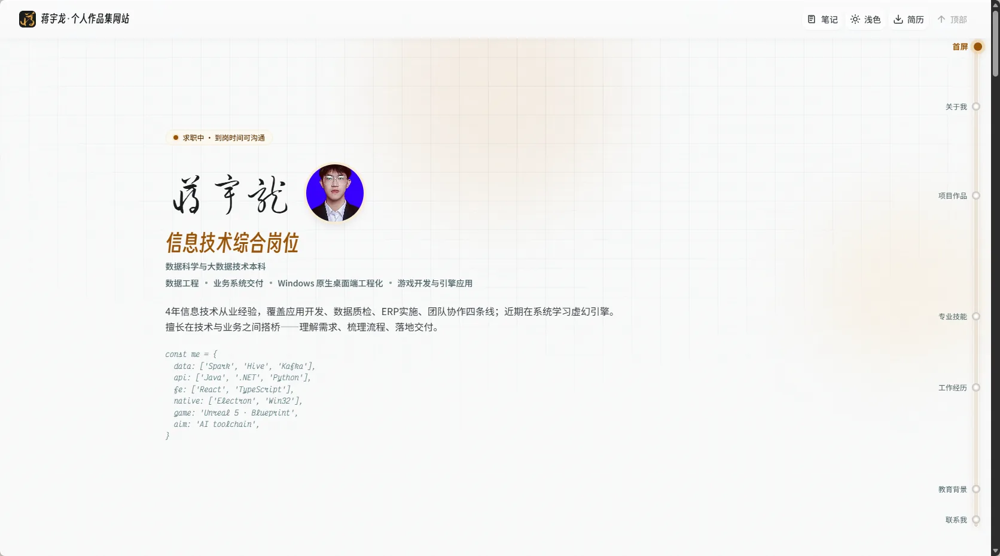
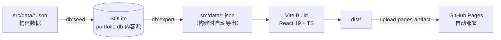

<h1 align="center">蒋宇龙 · 个人作品集网站</h1>

<p align="center">个人求职作品集单页应用：AI 应用平台型全栈工程师，覆盖数据工程、业务系统交付与 Windows 原生桌面端工程化。</p>

<p align="center">
  <a href="./README.md">简体中文</a> | <a href="./README.en.md">English</a>
</p>

<p align="center">
  <a href="https://github.com/White-147/jyl-site/actions/workflows/deploy.yml"></a>
  
  
  
  <a href="./LICENSE"></a>
</p>

<p align="center">
  
</p>

个人求职作品集单页应用。项目以「AI 应用平台型全栈工程师」为定位，围绕数据工程、业务系统交付与 Windows 原生桌面端工程化三条主线，集中展示 MiLuStudio、XiaoLouAI、SyLabAI 等可验证项目，并提供项目方向筛选（AI 应用 / 企业系统 / 大数据）、技能模糊搜索、明暗主题切换与最新简历 PDF 下载。

当前站点已部署上线：[https://white-147.github.io/jyl-site/](https://white-147.github.io/jyl-site/)。内容以 SQLite 数据库（`database/portfolio.db`）为唯一内容源，构建时自动导出为 JSON 并打包，推送到 `main` 分支即通过 GitHub Actions 自动构建部署到 GitHub Pages。

> 说明：站点内容与简历保持同一口径（真实项目与真实公司名）。头像、证书、项目截图原图保存在 `_archive/`（已随仓库上传，供备份与后续补充使用）。

## 项目功能

- 单页滚动式布局，浅色 / 深色模式切换（跟随系统或手动，状态栏配色同步）
- 项目按岗位方向筛选：AI 应用 / 企业系统 / 大数据
- 项目索引列表：行号 + 缩略图 + 技术栈展开/收起 + 要点折叠 + 灯箱放大
- 技能分组展示：12 个工程领域分组、模糊搜索（大小写/符号/空格归一）、高频快捷标签
- About 阶段化叙事：早期 / 近期 / 日常 + 三条能力链路数字卡片
- **项目在线预览**：各项目的静态前端嵌入本站（`public/preview/`），卡片「在线体验」直达；无后端项目显示适配各项目风格的演示提示条（深浅色双态）
- **演示模式**：BookRecommendation / MiLuStudio 采用构建开关（`VUE_APP_EMBEDDED_DEMO` / `VITE_EMBEDDED_DEMO`）内置示例数据，无后端也能直入登录后首页
- **SPA fallback**：`404.html` 将深链刷新（BrowserRouter 子路由 / 遗留畸形 URL）兜底回所属应用入口
- 简历 PDF 一键下载（`public/resume.pdf`，随投递版本更新）
- 移动端适配：底部 Tab Bar、安全区、置顶胶囊导航、单列布局
- 内容驱动：SQLite 数据库 → 构建时导出 JSON → 打包部署

## 技术栈

| 模块 | 技术 |
| --- | --- |
| 前端 | React 19、TypeScript、Vite、Tailwind CSS 4 |
| 动效 | GSAP（ScrollTrigger）+ IntersectionObserver，全站尊重 `prefers-reduced-motion` |
| 字体 | 五层字体体系：正文 Noto Sans SC、展示层得意黑（Smiley Sans）、名字柳建毛草、数字 Fraunces、等宽 Victor Mono（`scripts/subset-fonts.mjs` 子集化，均自托管） |
| 数据 | SQLite（`database/portfolio.db`，内容源） |
| 脚本 | Node.js（seed / export / subset-fonts 数据与字体管线；polish-previews 预览页演示注入；start-all 面试演示一键启动） |
| 部署 | GitHub Pages + GitHub Actions（`deploy.yml`） |

## 系统架构



站点内容与展示完全分离：内容（项目、技能、经历、文案）全部来自 `src/data/*.json`，组件只负责渲染与交互；内容变更通过 `db:seed` / `db:export` 双向同步，改数据不碰代码。

## 目录结构

```text
jyl-site/
├── _archive/                 # ★ 原始素材归档（头像 / 证书 / 项目截图 / 简历原件）
├── database/
│   └── portfolio.db          # ★ SQLite 内容库（内容源）
├── docs/
│   ├── assets/screenshots/   # 项目截图
│   └── design/               # 设计过程文件（色板预览等）
├── public/
│   ├── resume.pdf            # 站点简历（最新版覆盖即可）
│   ├── 404.html              # SPA fallback：深链刷新兜底回应用入口
│   ├── preview/              # ★ 内嵌项目预览（各项目前端静态产物 + 演示注入）
│   ├── projects/*.webp       # 项目截图（构建资源）
│   └── images/ certificates/ # 头像、证书缩略图
├── scripts/
│   ├── seed-db.mjs           #   JSON → 数据库（npm run db:seed）
│   ├── export-db.mjs         #   数据库 → JSON（npm run db:export）
│   ├── subset-fonts.mjs      #   站点五层字体子集化（新增文案后重新运行）
│   ├── polish-previews.mjs   #   预览页演示提示注入（重跑即覆盖更新）
│   └── start-all.ps1 / .bat  #   面试演示：一键启动本站各项目（本地运行）
├── src/
│   ├── data/*.json           # 构建数据（由数据库导出生成，勿手改）
│   ├── data/types.ts         # 数据类型定义
│   ├── fonts/                # 站点专用字体子集（subset-fonts.mjs 生成）
│   └── components/           # 页面组件
├── .github/workflows/deploy.yml
├── LICENSE
└── README.md
```

## 项目在线预览

站点内嵌各项目前端（`public/preview/<id>/`，GitHub Pages 子路径直接服务），详情如下：

| 项目 | 在线入口 | 数据来源 |
| --- | --- | --- |
| SyLabAI / XiaoLouAI / MiLuAssistantWeb | 静态前端 + 演示提示条 | 无后端（界面演示） |
| MiLuStudio | 嵌入演示模式（`VITE_EMBEDDED_DEMO`） | 内置示例项目，直入工作台首页 |
| BookRecommendation | 嵌入演示模式（`VUE_APP_EMBEDDED_DEMO`）+ 演示自动登录 | 内置示例数据（图书/推荐/借阅） |
| ShopRecommendation | 独立 Render 部署（另有主页链接） | 完整后端 |

配套机制：

- **演示提示条**：`scripts/polish-previews.mjs` 向每个预览页注入「演示模式 · 后端未部署」提示（**按项目品牌配色、深浅色双态**），并将缺后端报错优雅替换；幂等，重跑即更新
- **深链刷新兜底**：`public/404.html` 识别预览路径并跳回应用入口（BrowserRouter 应用刷新不再 404）
- **演示模式开关**：各项目以构建时环境变量启用（不污染正常开发），如 `npx vite build --mode embedded` / `npm run build -- --mode embedded`

## 本地运行

```bash
npm install
npm run dev      # 开发预览 http://localhost:5173
npm run build    # 类型检查 + 生产构建（输出 dist/）
npm run preview  # 预览生产构建
```

## 内容维护（数据流）

**内容源头是 `database/portfolio.db`（SQLite）**，构建时自动从数据库导出 JSON：

```bash
npm run db:seed    # 用 src/data/*.json 重建/覆盖数据库（改内容时先改 JSON 再 seed）
npm run db:export  # 从数据库导出 JSON（npm run build 会自动执行）
npm run build      # = db:export + 类型检查 + 构建
```

日常改内容的两种方式：

1. **改 JSON → 入库**：编辑 `src/data/*.json`，执行 `npm run db:seed` 同步到库；
2. **改数据库 → 出 JSON**：直接用 SQLite 工具改 `database/portfolio.db`，执行 `npm run db:export` 重新生成 JSON。

换简历：覆盖 `public/resume.pdf`（原件归档在 `_archive/resumes/`）。
新增证书/头像：压缩后的 WebP 放 `public/` 对应目录，原图放入 `_archive/` 对应目录，再改 `education.json` 或相关数据。

> 新增或修改站点文案后，请重新运行 `node scripts/subset-fonts.mjs` 生成最新字体子集（新用字不在子集内会回退到系统字体）。

## 图片与命名规范

- 站点图片统一放 `public/` 下，按类型分目录：`projects/`、`certificates/`、`images/`（头像）
- **命名规则**：小写 kebab-case（连字符分隔）；产品名保持紧凑（`milustudio`、`xiaolouai`），通用词用连字符（`milu-assistant-web`、`book-recommendation`、`cet-4`、`sanchuang-medal`）
- `_archive/` 归档文件与 `public/` 站点文件一一对应、命名一致（简历 PDF 除外，保留原名便于识别）
- 数据源为 SQLite（`database/portfolio.db`），其中存储的图片路径与 `public/` 实际文件名严格一致；新增/改名图片后执行 `npm run db:seed` 同步

## 部署到 GitHub Pages

仓库已配置 GitHub Actions（`.github/workflows/deploy.yml`），推送到 `main` 分支即自动构建并部署：

1. 构建流程：`npm ci` → `npm run build`（自动执行 `db:export` 从数据库导出 JSON，再做类型检查与打包）
2. 部署流程：`upload-pages-artifact` 上传 `dist/`，`deploy-pages` 发布到 GitHub Pages
3. 访问地址：https://white-147.github.io/jyl-site/

> 如需自定义域名：在仓库 Settings → Pages 中绑定已备案域名；如切换 Vercel/Netlify 部署，将根目录 `_redirects`/配置文件与 Actions 工作流一并调整即可。

## 设计系统

- **视觉基调「青玉 · 深空青」**：主色青玉（teal `#0f766e`）+ 高亮碧青（cyan），浅色冷白微青底、深色深青黑底；深浅两套色彩同族，深色粒子液柱与浅色主色统一。
- **字体五层体系**：正文 Noto Sans SC（自托管子集 4 字重）、展示层**得意黑**（区块标题/品牌）、名字**柳建毛草**（Hero 专属，草书）、数字 **Fraunces**（统计/强调数字）、等宽 **Victor Mono**（代码彩蛋/行号，含斜体变体）；`scripts/subset-fonts.mjs` 按站点用字子集化，新增文案后需重新运行。
- **动效**：GSAP（Hero 入场序列 + About 链路连接线 scrub），全站尊重 `prefers-reduced-motion`；其余滚动渐显由 IntersectionObserver 驱动。
- **版式特色**：Hero 编辑式排版（名字超大两行 + 头像签名章 + 等宽代码彩蛋）；项目区「编辑索引行」差异化；技能区模糊搜索 + 桌面双列均衡；About 阶段化叙事 + 能力链路数字卡。

## 项目亮点

- 内容驱动架构：SQLite 单一内容源，JSON 由构建导出，改数据不碰代码。
- 与简历同口径：站点简历下载与投递版保持同步更新，公司名、项目名、时间线一致。
- 数据流脚本化：`db:seed` / `db:export` 双向同步，内容维护成本低。
- 字体子集化管线：五层字体按站点用字打包为单个 woff2（得意黑 113KB / 柳建毛草 10KB / Fraunces 18KB / Victor Mono 16+21KB），首屏字体开销可控。
- 项目在线预览：`public/preview/` 内嵌 5 个项目前端 + 演示模式开关，作品集内即可直达"登录后首页"。
- SPA 刷新兜底：`404.html` 单文件解决 BrowserRouter 深链刷新 404。
- 全站可访问性：键盘焦点可见、ARIA 标注、`prefers-reduced-motion` 降级、安全区适配。
- 自动化部署：推送即构建发布（GitHub Actions + GitHub Pages），无需手动操作。
