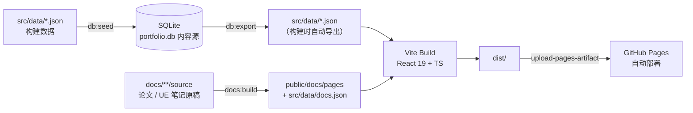

<h1 align="center">蒋宇龙 · 个人作品集网站</h1>

<p align="center">个人求职作品集单页应用：信息技术综合岗位，覆盖数据工程、业务系统交付与 Windows 原生桌面端工程化。</p>

<p align="center">
  <a href="./README.md">简体中文</a> | <a href="./README.en.md">English</a>
</p>

<p align="center">
  <a href="https://github.com/White-147/jyl-site/actions/workflows/deploy.yml"></a>
  
  
  
  <a href="./LICENSE"></a>
</p>

<p align="center">
  
</p>

个人求职作品集单页应用，围绕「信息技术综合岗位」组织内容，覆盖数据工程、业务系统交付、Windows 原生桌面端工程化与游戏开发（虚幻引擎）四条主线，集中展示 MiLuStudio、XiaoLouAI、SyLabAI 等可验证项目，并内置站内 UE 学习笔记与毕业论文。

站点提供项目方向筛选（AI 应用 / 企业系统 / 大数据）、技能模糊搜索、明暗主题切换、项目在线体验入口与简历 PDF 下载；手机端按 60% 流量口径单独适配（底部 Tab Bar + 常驻玻璃顶栏）。

当前站点已部署上线：[https://white-147.github.io/jyl-site/](https://white-147.github.io/jyl-site/)。内容以 SQLite 数据库（`database/portfolio.db`）为唯一内容源，构建时自动导出为 JSON 并打包，推送到 `main` 分支即通过 GitHub Actions 自动构建部署到 GitHub Pages。

> 说明：站点内容与投递简历保持同一口径（真实项目与真实公司名）。头像、证书、项目截图、UE 笔记配图**只保留压缩后的 WebP**（在 `public/` 里），原图归档已于 2026-09 清理、不再随仓库与本机保存 —— 需要原图时从外部备份取回，并按「图片与命名规范」重新压缩。

## 项目功能

- 单页滚动式布局，浅色 / 深色 / 跟随系统三种主题模式，状态栏配色同步
- **项目按岗位方向筛选**：AI 应用 / 企业系统 / 大数据，项目行含缩略图、方向标签、GitHub 入口与截图灯箱
- **技能画像**：8 个岗位方向画像分组展示、模糊搜索（大小写 / 符号 / 空格归一）、高频快捷标签
- **关于我**：早期 / 近期 / 日常阶段化叙事 + 四条能力链路数字卡片（数据工程 / 业务交付 / AI 工具链 / UE 游戏开发）
- **区块导航**：全端常驻玻璃顶栏（品牌 +「笔记 / 主题 / 简历 / 顶部」四个控件）+ 桌面与平板右侧贯穿式玻璃管（章节节点 + 阅读进度液柱）+ 手机端底部浮动胶囊 Tab Bar
- **项目在线体验**：各项目静态前端嵌入本站（`public/preview/`），卡片「在线体验」直达；无后端项目显示适配其配色的演示提示条（深浅色双态）
- **文档区**：站内 `#/docs` 收录毕业论文与 UE 学习笔记，左栏**两级下钻**（文档列表 → 该篇目录）+ 分区封面页 + 标题锚点跳转 + 跨文档互链 + 配图灯箱，正文整块可复制，换分区/退回一级带视图过渡
- **教育经历与证书**：学校信息横条 + 证书/奖项 2×2 网格，点击放大查看证明原件
- **联系区**：邮箱「点击复制」、GitHub 等入口，一键下载带水印的简历 PDF
- 移动端适配：常驻玻璃顶栏、底部浮动胶囊 Tab Bar、安全区、单列布局
- **触屏交互**：手机与平板上的高亮跟随**滚动位置**（视线所在的那张卡亮起，任何时刻只有一张），点击另有按下反馈；筛选胶囊与文档区目录不参与（它们的"照亮"会被误读成"已选中"）；桌面端保持鼠标悬停不变
- 内容驱动：SQLite 数据库 → 构建时导出 JSON → 打包部署，改内容不碰组件
- **内容保护**：邮箱混淆渲染 + 诱饵地址、预览页 iframe 防护、`robots.txt` 拒 AI 语料采集、简历 PDF 全页对角水印（保留文本层，ATS 友好）
- **内容只读**：默认禁止选中/复制，仅联系区邮箱与文档区正文标记 `data-copyable` 放行
- **可访问性**：正文对比度满足 WCAG 2.2 AA（浅深两套均以无头浏览器实测复核）、灯箱焦点陷阱与焦点归还、键盘全可达、尊重 `prefers-reduced-motion`、打印拦截并引导至 PDF 简历
- **性能**：首屏只内联名字字体、中文字体保留 400/500/700 三档并按需 preload、首屏以下区块延迟渲染、常驻动画离屏暂停、桌面 CLS 0

## 技术栈

| 模块 | 技术 |
| --- | --- |
| 前端 | React 19、TypeScript、Vite、Tailwind CSS 4 |
| 动效 | GSAP（首屏入场序列）+ IntersectionObserver（滚动渐显），全站尊重 `prefers-reduced-motion` |
| 字体 | 五层字体体系：正文 Noto Sans SC、展示层得意黑（Smiley Sans）、名字柳建毛草、数字 Fraunces、等宽 Victor Mono（`scripts/subset-fonts.mjs` 子集化 + `inline-firstscreen-fonts.mjs` 内联首屏，全部自托管） |
| 图标 | 由柳建毛草字体渲染「蒋」字标（`scripts/gen_icons.py`），输出 favicon 全尺寸 + maskable |
| 数据 | SQLite（`database/portfolio.db`，内容源） |
| 脚本 | Node.js（数据 seed/export、字体与图标管线、联系方式编码、文档构建与断言）+ Python（简历水印、配图压缩、图标生成） |
| 部署 | GitHub Pages + GitHub Actions（`deploy.yml`） |

## 系统架构


```mermaid
flowchart LR
    JSON["src/data/*.json\n构建数据"] -->|db:seed| DB[("SQLite\nportfolio.db 内容源")]
    DB -->|db:export| JSON2["src/data/*.json\n（构建时自动导出）"]
    JSON2 --> Build["Vite Build\nReact 19 + TS"]
    Docs["docs/**/source\n论文 / UE 笔记原稿"] -->|docs:build| Pages["public/docs/pages\n+ src/data/docs.json"]
    Pages --> Build
    Build --> Dist["dist/"]
    Dist -->|upload-pages-artifact| GH["GitHub Pages\n自动部署"]
```

内容与展示完全分离：项目、技能、经历、文案全部来自 `src/data/*.json`，组件只负责渲染与交互；文档区正文由 `scripts/build-docs.mjs` 从 `docs/**/source` 的原始稿件构建成静态页，两者都在构建期完成，运行时没有后端。

## 目录结构

```text
jyl-site/
├── database/
│   └── portfolio.db          # ★ SQLite 内容库（内容源）
├── MAINTAINING.md            # ★ 工程维护（联动点清单 / 目录与构建约定 / 修订记录）
├── materials/                # ★ 源素材（未加工的原料：原件 / 原图 / 字体源；整目录 gitignore）
│   ├── resumes/              #   简历原件（蒋宇龙简历.pdf、蒋宇龙附件简历.pdf）
│   ├── certificates/         #   证书 / 奖项原件（PNG/JPG）
│   ├── avatars/              #   头像原件
│   ├── projects/             #   项目截图原件
│   ├── thesis/images/        #   论文插图原件
│   ├── fonts/                #   字体源 TTF（subset-fonts.mjs 的输入）
│   ├── icons/                #   图标源图形（进 git）
│   └── site/hero.webp        #   README 展示用站点截图（进 git）
├── docs/                     # ★ 文档区**内容源**（站点要交付的正文）
│   ├── thesis/source/{md,pdf}/   # 毕业论文源（pandoc 从 docx 转出的 HTML）
│   ├── theory/source/{md,pdf}/   # UE 理论源（markdown 笔记 + 原件 PDF）
│   └── combat/source/{md,pdf}/   # UE 实战源（markdown 笔记；FPS 篇仍是占位页）
├── public/
│   ├── downloads/resume.pdf  #   站点简历（最新版覆盖即可）
│   ├── 404.html              #   SPA fallback：深链刷新兜底回应用入口
│   ├── robots.txt            #   抓取策略（放行搜索引擎、拒绝 AI 语料采集）
│   ├── sitemap.xml           #   站点结构
│   ├── manifest.webmanifest  #   站点图标清单（含 Android maskable）
│   ├── preview/              # ★ 内嵌项目预览（各项目前端静态产物）
│   ├── docs/pages/           #   文档区页面产物（构建生成，已 gitignore）
│   ├── favicons/             #   站点图标（由 scripts/gen_icons.py 生成）
│   └── images/               #   站内全部图片（平铺，靠文件名前缀分辨类别）：
│                             #     avatar-* 头像 ｜ brand-* 纹样装饰
│                             #     cert-*   证书奖项 ｜ proj-*  项目截图
├── scripts/                  #   纯脚本（素材都在 materials/ 下）
│   ├── seed-db.mjs           #   JSON → 数据库（npm run db:seed）
│   ├── export-db.mjs         #   数据库 → JSON（npm run db:export）
│   ├── subset-fonts.mjs      #   五层字体子集化（新增文案后重跑）
│   ├── inline-firstscreen-fonts.mjs   # 首屏字体 base64 内联（随上一步自动运行）
│   ├── gen_icons.py          #   站点图标：从柳建毛草渲染「蒋」字标
│   ├── build-docs.mjs        #   文档区构建：把源拆成页并生成导航与清单
│   ├── check-docs.mjs        #   文档产物自检（配图缺失 / 大纲悬空 / 路由冲突）
│   ├── check-anchors.mjs     #   真浏览器断言（锚点落点 / 横栏材质 / 互链 / 左栏折叠 / 导航冒烟）
│   ├── prepare-thesis.mjs    #   论文 docx → HTML
│   ├── optimize_images.py    #   配图压缩成 WebP（论文与 UE 笔记共用）
│   ├── encode-contact.mjs    #   联系方式混淆表生成
│   ├── watermark_resume.py   #   简历 PDF 全页对角水印
│   ├── polish-previews.mjs   #   预览页演示提示 + iframe 防护注入
│   └── start-all.ps1 / .bat  #   一键启动本站与各项目（本地演示）
├── src/
│   ├── data/*.json           #   构建数据（由数据库导出生成）
│   ├── data/navigation.ts    #   区块注册表（导航 / 滚动侦测共用）
│   ├── data/scrollTargets.ts #   锚点偏移单一来源
│   ├── data/contact.ts       #   联系方式混淆层
│   ├── fonts/                #   字体子集（subset-fonts.mjs 生成）
│   ├── hooks/                #   useTheme / useScrollSpy / useAnchorScroll 等
│   └── components/           #   页面组件
├── .github/workflows/deploy.yml
├── DESIGN.md                 #   设计系统（token 与组件规范）
├── PRODUCT.md                #   产品口径（用户 / 反参考 / 设计原则）
├── MAINTAINING.md            #   工程维护（改代码前必读）
└── LICENSE
```

> 仓库根只留"功能族"：`src`（应用源码）｜`public`（部署根）｜`docs`（文档区内容源）｜
> `materials`（源素材）｜`scripts`（脚本）｜`database`（数据源）。
> 分目录口径、`.gitignore` 规则与历史沿革见 [MAINTAINING.md](./MAINTAINING.md)。

## 本地运行

```bash
npm install
npm run dev      # 开发预览 http://localhost:5173
npm run build    # 类型检查 + 生产构建（输出 dist/）
npm run preview  # 预览生产构建
```

> `dev` 与 `build` 都会先自动重建文档区产物（`predev` / `prebuild`），所以不需要手动跑转换脚本。

## 内容维护（数据流）

**内容源头是 `database/portfolio.db`（SQLite）**，构建时自动导出 JSON：

```bash
npm run db:seed    # 用 src/data/*.json 重建/覆盖数据库（改内容时先改 JSON）
npm run db:export  # 从数据库导出 JSON（npm run build 会自动执行）
npm run build      # = db:export + 类型检查 + 构建
```

日常改内容两种方式：编辑 `src/data/*.json` 后 `npm run db:seed` 入库；或直接用 SQLite 工具改库后 `npm run db:export` 出 JSON。

> 其余维护动作（字体子集、简历水印、图标生成、联系方式编码、预览页注入、文档区各类脚本）
> 见 [MAINTAINING.md](./MAINTAINING.md)。`package.json` 的 `scripts` 里也都能看到。

## 文档区（毕业论文 · UE 理论 · UE 实战）

站内文档区位于 `#/docs`（hash 路由，不需要服务端重写），把两类外部原稿转成可读的文档站：
**左栏两级下钻**（一级 = 文档列表 → 二级 = 该篇目录）、分区封面页、标题锚点跳转、
配图点击放大（复用站点灯箱）、正文整块放开复制、跨文档互链（可带 `#标题` 锚点）。
三个分区：**毕业论文 / UE 理论 / UE 实战**。

内容源在 `docs/<分区>/source/`（论文为 pandoc 转出的 HTML，UE 笔记为 markdown），
构建器按标题层级**贪心拆页**，避免一篇文章在手机上要滚几十屏才到底。
改动流程、格式硬约束与验证方式见 [MAINTAINING.md](./MAINTAINING.md)。

## 反爬与内容保护

客户端方案无法真正阻止抓取，目标是提高无差别采集的成本，同时不影响招聘方的正常使用：
`robots.txt` 放行搜索引擎、拒绝 AI 语料采集与批量抓取；`sitemap.xml` 提供结构；
联系方式不以明文出现；简历 PDF 带全页水印但保留文本层（ATS 可解析）；
内嵌预览页加 iframe 防护。全站默认禁止选中/复制，仅联系区邮箱与文档区正文放行；
打印一律拦截并引导至 PDF 简历。

> 各层的具体手段与位置见 [MAINTAINING.md](./MAINTAINING.md)。

## 项目在线体验

站点内嵌各项目前端（`public/preview/<id>/`，GitHub Pages 子路径直接服务）：

| 项目 | 在线入口 | 数据来源 |
| --- | --- | --- |
| SyLabAI / XiaoLouAI / MiLuAssistantWeb | 静态前端 + 演示提示条 | 无后端（界面演示） |
| MiLuStudio | 嵌入演示模式 | 内置示例项目，本地确定性流程可交互 |
| BookRecommendation | 嵌入演示模式 + 演示自动登录 | 内置示例数据（图书 / 推荐 / 借阅） |
| ShopRecommendation | 独立 Render 部署（另有主页链接） | 完整后端 |

## 部署到 GitHub Pages

仓库已配置 GitHub Actions（`.github/workflows/deploy.yml`），推送到 `main` 分支即自动构建并部署：

1. 构建：`npm ci` → `npm run build`（自动 `db:export` 从数据库导出 JSON，再重建文档区、做类型检查与打包）
2. 部署：`upload-pages-artifact` 上传 `dist/`，`deploy-pages` 发布到 GitHub Pages
3. 访问地址：https://white-147.github.io/jyl-site/

> 如需自定义域名：在仓库 Settings → Pages 中绑定域名。
>
> 访问速度说明：站点资源全部同源托管，`github.io` 在大陆无代理时会明显偏慢（首屏走缓存后正常）。代码侧体积优化已完成，剩下的瓶颈是线路本身，当前不做镜像或代理部署。

## 相关文档

- [DESIGN.md](./DESIGN.md)：设计系统 —— 颜色 / 字体 / 层级 / 组件 / 禁忌
- [PRODUCT.md](./PRODUCT.md)：产品口径 —— 目标用户 / 反参考 / 设计原则 / 可访问性要求
- [MAINTAINING.md](./MAINTAINING.md)：工程维护 —— 联动点清单、目录与构建约定、历次修订记录（**改代码前必读**）
